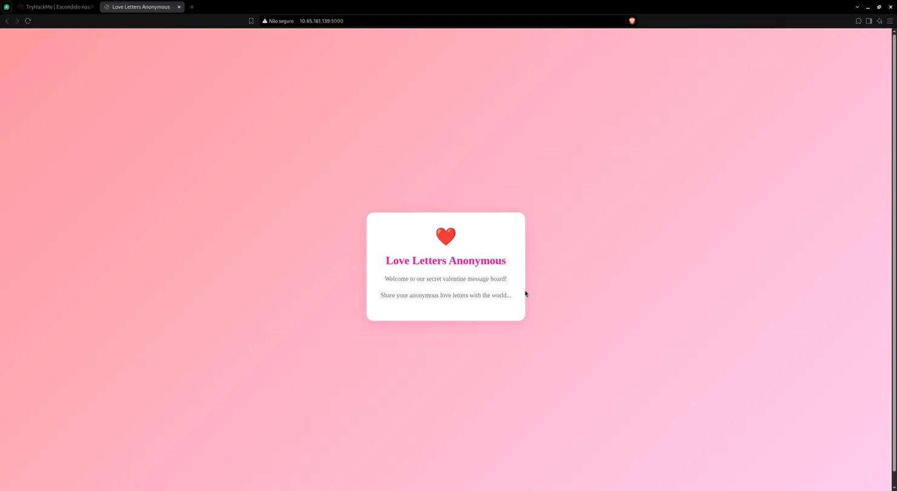
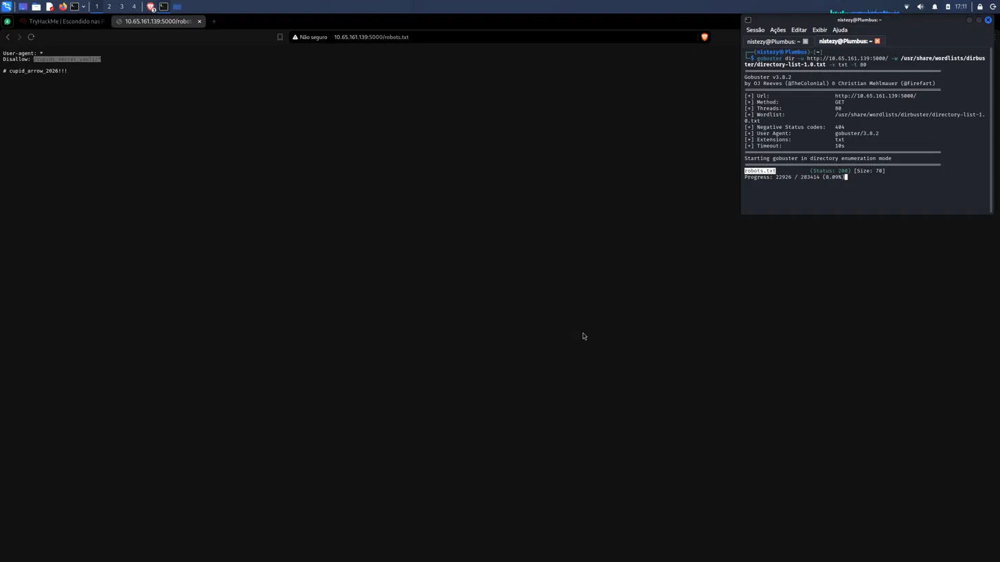
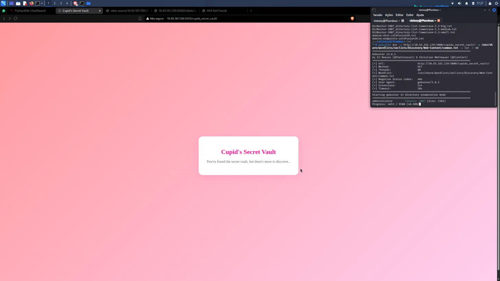
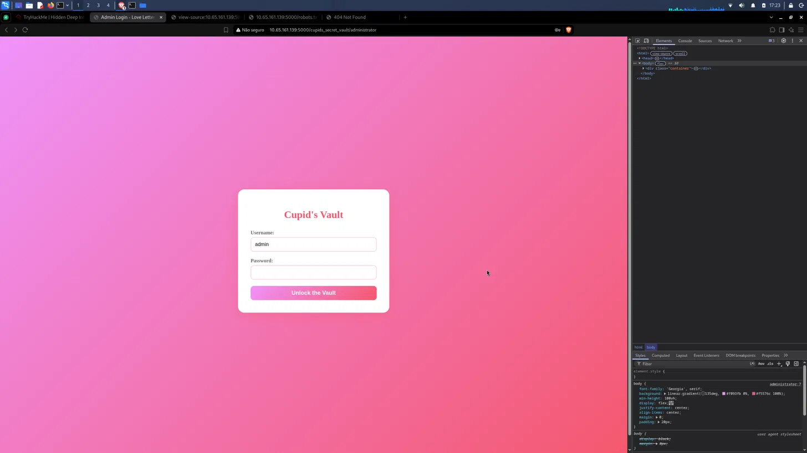

# TryHackMe — Hidden Deep Into my Heart
## Level 1 — Cupid's Vault

**Categoria:** Web / Enumeração de Diretórios / Credenciais em robots.txt  
**Dificuldade:** Fácil

---

### 💌 Concierge Briefing

> My Dearest Hacker,
> Cupid's Vault was designed to protect secrets meant to stay hidden forever. Unfortunately, Cupid underestimated how determined attackers can be. Intelligence indicates that Cupid may have unintentionally left vulnerabilities in the system. With the holiday deadline approaching, you've been tasked with uncovering what's hidden inside the vault before it's too late.
>
> You can find the web application here: `http://10.65.161.139:5000`

---

## 🎯 Objetivo

O briefing dá uma pista sutil: Cupido pode ter **deixado vulnerabilidades sem querer**. A aplicação em questão é um mural de cartas de amor anônimas — aparentemente inofensiva. O objetivo é mapear o que está escondido além da página inicial, seguir os rastros de descuido deixados pelo administrador e encontrar a flag guardada no cofre secreto.

---

## 🔍 Passo 1 — Homepage: Love Letters Anonymous

Acessando a aplicação em `http://10.65.161.139:5000`:



A página inicial exibe um mural temático de Dia dos Namorados:

> *"Love Letters Anonymous"*
> *"Welcome to our secret valentine message board! Share your anonymous love letters with the world..."*

Nada de funcionalidades expostas, nenhum formulário visível — o interesse está no que **não aparece** na página. O próximo passo é mapear os caminhos ocultos da aplicação.

---

## 🔍 Passo 2 — Gobuster + robots.txt: A Senha na Vista de Todos

Com o Gobuster, foi feita uma enumeração de diretórios na raiz da aplicação:

```bash
gobuster dir \
  -u http://10.65.161.139:5000/ \
  -w /usr/share/wordlists/dirbuster/directory-list-1.0.txt \
  -x txt \
  -t 60
```



O Gobuster encontrou `robots.txt` (Status: 200). Acessando o arquivo:

```
User-agent: *
Disallow: /cupids_secret_vault

# cupid_arrow_2026!!!
```

Dois achados críticos em um único arquivo:

**1.** A diretiva `Disallow: /cupids_secret_vault` revela um **caminho oculto** que o administrador tentou esconder dos mecanismos de busca — e acabou transformando em destino óbvio para qualquer atacante que lê o `robots.txt`.

**2.** O comentário `# cupid_arrow_2026!!!` contém o que aparenta ser uma **senha**, deixada no próprio arquivo público como lembrete do administrador.

`robots.txt` é um arquivo completamente público. Qualquer visitante pode acessá-lo sem autenticação.

---

## 🔍 Passo 3 — Cupid's Secret Vault: Há Mais a Descobrir

Acessando o caminho revelado pelo `robots.txt` em `http://10.65.161.139:5000/cupids_secret_vault/`:



A página exibe:

> *"Cupid's Secret Vault"*
> *"You've found the secret vault, but there's more to discover..."*

A mensagem é uma dica explícita: existe algo além desta página. Um segundo round de Gobuster foi executado, desta vez **dentro do diretório descoberto**:

```bash
gobuster dir \
  -u http://10.65.161.139:5000/cupids_secret_vault/ \
  -w /usr/share/wordlists/seclists/Discovery/Web-Content/common.txt \
  -x txt \
  -t 80
```

```
administrator    (Status: 200) [Size: 2381]
```

Um painel de administrador em `/cupids_secret_vault/administrator` — acessível com status 200, sem qualquer controle de acesso por IP ou autenticação prévia.

---

## 🔍 Passo 4 — Painel de Administração: Cupid's Vault

Acessando `http://10.65.161.139:5000/cupids_secret_vault/administrator`:



Uma tela de login temática — **"Cupid's Vault"** — com campos de usuário e senha e o botão *"Unlock the Vault"*.

Com as informações já coletadas, as credenciais a testar eram evidentes:

| Campo | Valor |
|-------|-------|
| **Username** | `admin` |
| **Password** | `cupid_arrow_2026!!!` (comentário do `robots.txt`) |

---

## 🚩 Passo 5 — Flag: Welcome, Cupid!

Após o login com `admin` / `cupid_arrow_2026!!!`, o painel foi desbloqueado:


```
Welcome, Cupid!
Congratulations! You've discovered Cupid's secret vault and found the hidden treasure of love!

THM{l0v3_is_in_th3_r0b0ts_txt}
```

O popup de salvar senha do navegador confirma as credenciais utilizadas:
- **Nome de usuário:** `admin`
- **Senha:** `cupid_arrow_2026!!!`

A flag, por sinal, é autoexplicativa sobre onde estava a falha.

---

## 🚩 Flag

```
THM{l0v3_is_in_th3_r0b0ts_txt}
```

---

## 📝 Resumo da cadeia de investigação

1. **Homepage** → aplicação "Love Letters Anonymous" sem funcionalidades expostas na porta 5000
2. **Gobuster (raiz)** → descobre `robots.txt` (Status: 200)
3. **robots.txt** → duas informações críticas: caminho `/cupids_secret_vault` (Disallow) + senha `cupid_arrow_2026!!!` (comentário)
4. **`/cupids_secret_vault/`** → página de transição com a mensagem "there's more to discover"
5. **Gobuster (`/cupids_secret_vault/`)** → descobre `/administrator` (Status: 200)
6. **Login** com `admin` / `cupid_arrow_2026!!!` → vault desbloqueado
7. **Flag**: `THM{l0v3_is_in_th3_r0b0ts_txt}`

---