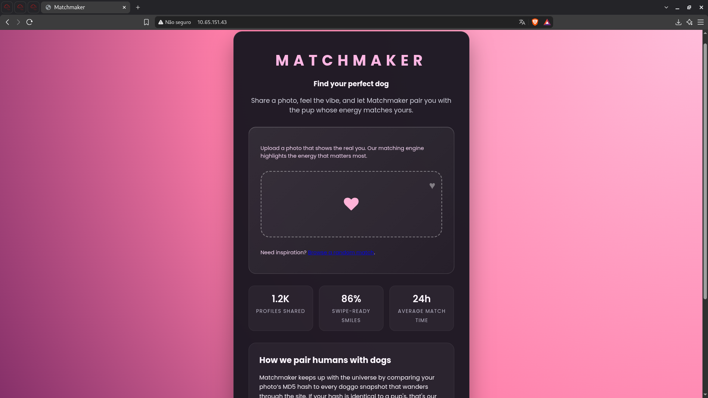
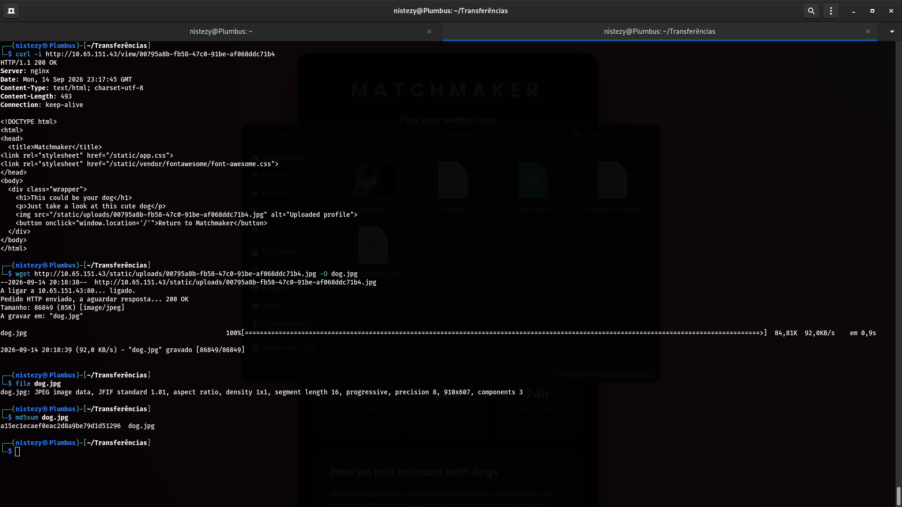
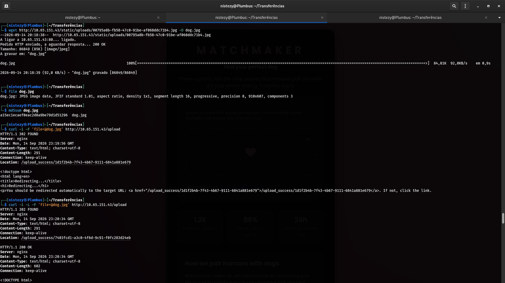
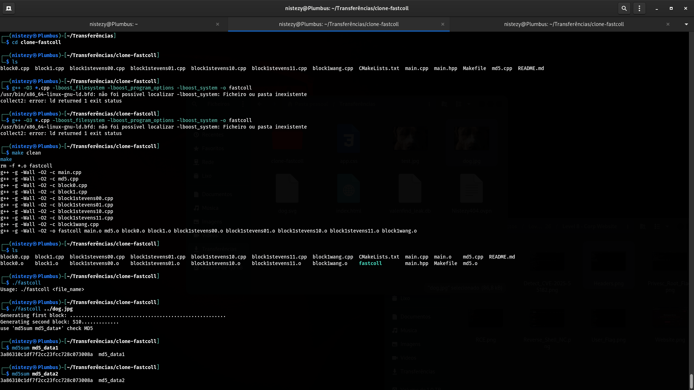
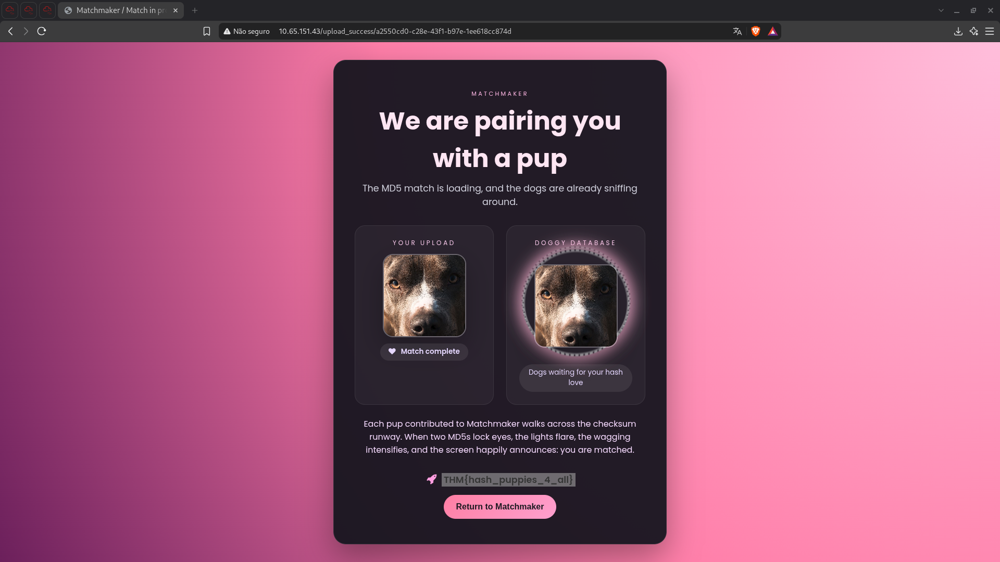

# TryHackMe — When Hearts Collide
## Level 10 — Matchmaker | MD5 Collision Attack (FastColl)

**Categoria:** Web / Criptografia / Colisão de Hash MD5 / Lógica de Negócio
**Dificuldade:** Médio

---

### 💌 Concierge Briefing

> My Dearest Hacker,
> Matchmaker is a playful, hash-powered experience that pairs you with your ideal dog by comparing MD5 fingerprints. Upload a photo, let the hash chemistry do its thing, and watch the site reveal whether your vibe already matches one of our curated pups. The algorithm is completely transparent, making every match feel like a wink from fate instead of random swipes.
> Come get your dog today!
>
> You can access the web app here: `http://10.65.151.43`

---

## 🎯 Objetivo

O briefing entrega a chave do desafio de forma explícita: o sistema de "match" da aplicação **Matchmaker** compara o **hash MD5** da foto enviada pelo usuário com os hashes de fotos de cachorros já cadastradas no banco de dados ("Doggy Database"). Se os hashes forem idênticos, ocorre um match. Como o MD5 é um algoritmo criptograficamente quebrado e vulnerável a **ataques de colisão**, o objetivo é forjar duas imagens diferentes com o **mesmo hash MD5**, cadastrar uma delas no sistema e, em seguida, enviar a segunda para forçar um match — sem depender de sorte ou de adivinhar a foto exata de um cachorro já existente.

---

## 🔍 Passo 1 — Homepage: Matchmaker e o Mecanismo de Match

Acessando `http://10.65.151.43`:



A página inicial já explica o funcionamento do sistema em texto claro:

> "Matchmaker keeps up with the universe by comparing your photo's MD5 hash to every doggo snapshot that wanders through the site. If your hash is identical to a pup's, that's your match."

Essa descrição confirma a lógica de negócio: **hash idêntico = match confirmado**, independentemente do conteúdo visual da imagem. Essa é precisamente a superfície de ataque a ser explorada.

---

## 🔍 Passo 2 — Localizando uma Foto Já Cadastrada via `/view/<uuid>`

Explorando a aplicação (a partir do link "Browse a random match" na homepage), foi possível acessar o endpoint `/view/<uuid>`, que exibe uma foto de cachorro já presente na base de dados:

```bash
curl -i http://10.65.151.43/view/00795a8b-fb58-47c0-91be-af068ddc71b4
```



```
HTTP/1.1 200 OK
Server: nginx
Content-Type: text/html; charset=utf-8
Content-Length: 493

<!DOCTYPE html>
<html>
<head>
  <title>Matchmaker</title>
<link rel="stylesheet" href="/static/app.css">
<link rel="stylesheet" href="/static/vendor/fontawesome/font-awesome.css">
</head>
<body>
  <div class="wrapper">
    <h1>This could be your dog</h1>
    <p>Just take a look at this cute dog</p>
    
    <button onclick="window.location='/'">Return to Matchmaker</button>
  </div>
</body>
</html>
```

A imagem referenciada foi baixada diretamente do diretório estático de uploads:

```bash
wget http://10.65.151.43/static/uploads/00795a8b-fb58-47c0-91be-af068ddc71b4.jpg -O dog.jpg
file dog.jpg
md5sum dog.jpg
```

```
dog.jpg: JPEG image data, JFIF standard 1.01, aspect ratio, density 1x1, segment length 16, progressive, precision 8, 910x607, components 3

a15ec1ecaef0eac2d8a9be79d1d51296  dog.jpg
```

Agora havia em mãos uma foto real de um cachorro já registrado na "Doggy Database", junto com seu hash MD5.

---

## 🔍 Passo 3 — Confirmando o Mecanismo de Upload e Match

Antes de forjar a colisão, o endpoint `/upload` foi testado com o próprio arquivo `dog.jpg` para entender o comportamento da aplicação:

```bash
curl -i -F 'file=@dog.jpg' http://10.65.151.43/upload
```



```
HTTP/1.1 302 FOUND
Location: /upload_success/1d1f2b4b-7f43-4b67-9111-6841a881e679
```

```bash
curl -i -L -F 'file=@dog.jpg' http://10.65.151.43/upload
```

```
HTTP/1.1 302 FOUND
Location: /upload_success/7403fcd1-a3c0-4f6d-9c91-f0fc283d24eb

HTTP/1.1 200 OK
Content-Type: text/html; charset=utf-8
Content-Length: 602

<!DOCTYPE html>
...
```

Isso confirmou o fluxo completo: cada upload gera um novo registro (`uuid`) e a página de resultado (`/upload_success/<uuid>`) informa se houve match comparando o MD5 do arquivo enviado com os hashes já armazenados no banco. Como esperado, reenviar o mesmo arquivo baixado gerou um match trivial — mas o verdadeiro objetivo era provar que **qualquer par de arquivos com o mesmo MD5** dispararia o mesmo resultado, mesmo sem ser literalmente o mesmo arquivo.

---

## 🔍 Passo 4 — Fabricando uma Colisão MD5 com o FastColl

Para demonstrar a fragilidade do MD5, a ferramenta **fastcoll** (gerador de colisões MD5 de prefixo idêntico) foi clonada e compilada:

```bash
git clone https://github.com/<...>/clone-fastcoll.git
cd clone-fastcoll
make clean
```



```
g++ -g -Wall -O2 -c main.cpp
g++ -g -Wall -O2 -c md5.cpp
...
g++ -g -Wall -O2 -o fastcoll main.o md5.o block0.o block1.o block1stevens00.o block1stevens01.o block1stevens10.o block1stevens11.o block1wang.o
```

Com o binário `fastcoll` pronto, a foto `dog.jpg` baixada anteriormente foi usada como **prefixo** para gerar duas variações que colidem:

```bash
./fastcoll ../dog.jpg
```

```
Generating first block: ................................................
Generating second block: S10............
use 'md5sum md5_data*' check MD5
```

A ferramenta gerou dois arquivos de saída, `md5_data1` e `md5_data2`, cada um contendo o conteúdo original de `dog.jpg` seguido de blocos de colisão diferentes — mas produzindo **exatamente o mesmo hash MD5**:

```bash
md5sum md5_data1
md5sum md5_data2
```

```
3a86310c1df7f2cc23fcc728c073008a  md5_data1
3a86310c1df7f2cc23fcc728c073008a  md5_data2
```

Dois arquivos com conteúdo binário diferente, mas hash MD5 idêntico — a colisão foi confirmada.

---

## 🚩 Passo 5 — Upload dos Arquivos Colididos e Captura da Flag

Com o par de arquivos colidentes em mãos, a estratégia foi simples:

1. Enviar `md5_data1` para o endpoint `/upload`, cadastrando-o como uma nova entrada na "Doggy Database" com o hash `3a86310c1df7f2cc23fcc728c073008a`.
2. Enviar `md5_data2` logo em seguida — como seu MD5 é **idêntico** ao de `md5_data1` já cadastrado, o sistema reconhece um match perfeito.

Ao acessar a página de resultado do segundo upload:



```
MATCHMAKER

We are pairing you with a pup

The MD5 match is loading, and the dogs are already sniffing around.

YOUR UPLOAD                         DOGGY DATABASE
[foto do cachorro]                  [mesma foto do cachorro]
❤ Match complete                    Dogs waiting for your hash love

Each pup contributed to Matchmaker walks across the checksum runway.
When two MD5s lock eyes, the lights flare, the wagging intensifies,
and the screen happily announces: you are matched.

🚀 THM{hash_puppies_4_all}
```

O sistema confirmou o match entre os dois arquivos forjados, exibindo a flag diretamente na tela de resultado.

**Flag: `THM{hash_puppies_4_all}`**

---

## 🚩 Flags

| Flag | Valor |
|------|-------|
| **Flag Única** | `THM{hash_puppies_4_all}` |

---

## 📝 Resumo da cadeia de investigação

1. **Homepage** → Matchmaker explica abertamente que o match é feito comparando hashes MD5 das fotos
2. **`/view/<uuid>`** → endpoint expõe uma foto já cadastrada na "Doggy Database"; `wget` + `md5sum` extraem a imagem e seu hash
3. **`/upload`** → teste inicial confirma o fluxo: cada envio gera um novo `uuid` e uma página de resultado que avalia o match por comparação de hash
4. **FastColl** → compilado e usado com `dog.jpg` como prefixo para gerar `md5_data1` e `md5_data2`, dois arquivos distintos com **MD5 idêntico** (`3a86310c1df7f2cc23fcc728c073008a`)
5. **Upload sequencial** → `md5_data1` cadastrado na base, depois `md5_data2` enviado, disparando o match graças à colisão MD5
6. **`/upload_success/<uuid>`** → página de resultado exibe "Match complete" e revela a flag: `THM{hash_puppies_4_all}`
