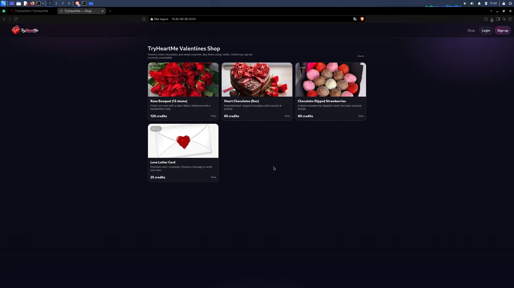
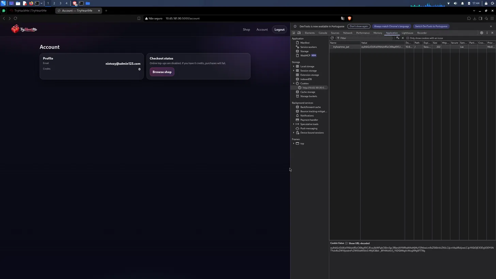
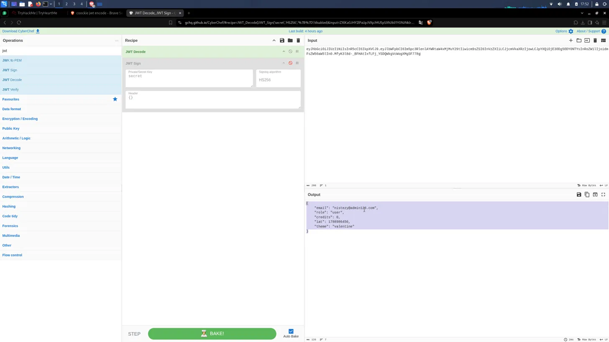
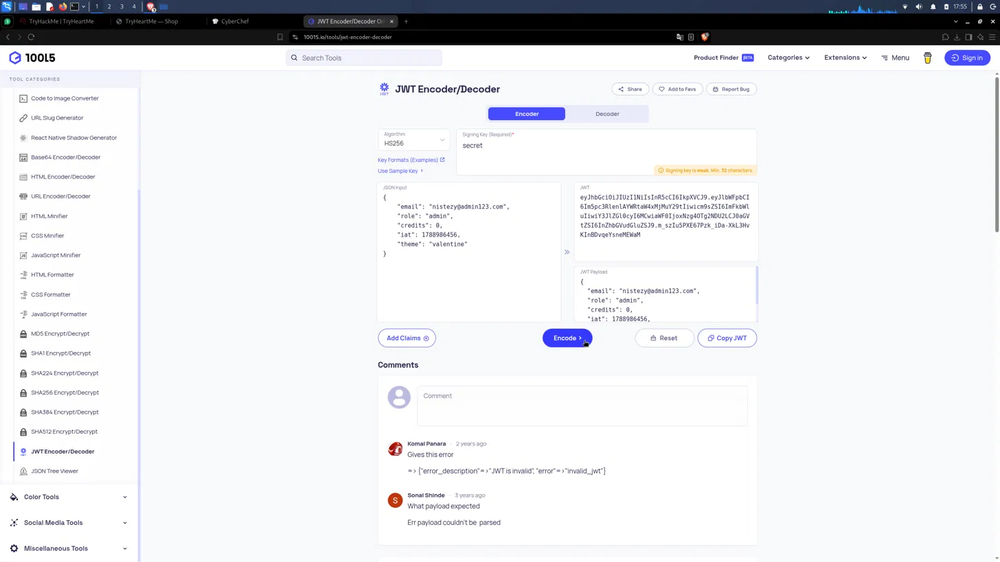
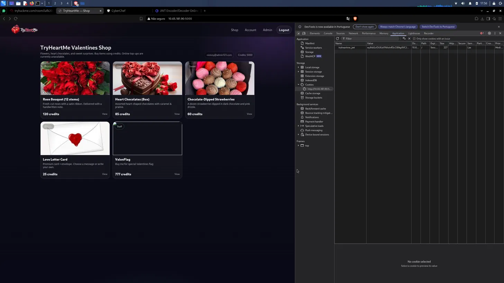
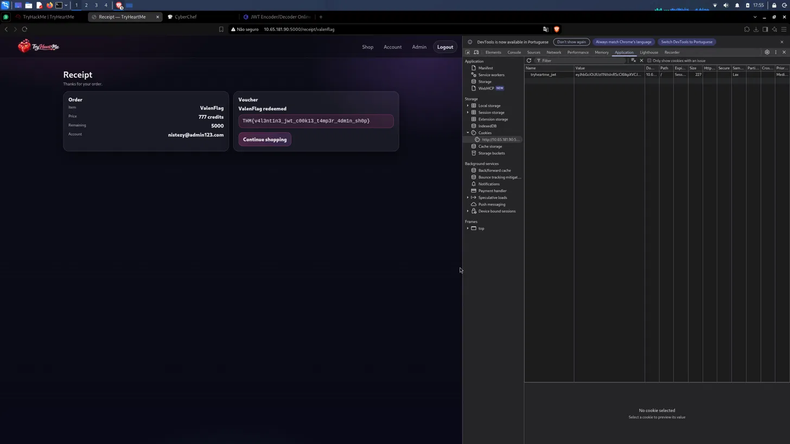

# TryHackMe — TryHeartMe
## Level 2 — Cupid's Shop

**Categoria:** Web / JWT Token Manipulation / Broken Access Control  
**Dificuldade:** Fácil-Médio

---

### 💌 Concierge Briefing

> The TryHeartMe shop is open for business. Can you find a way to purchase the hidden "Valenflag" item?
>
> You can access the web app here: `http://10.65.181.90:5000`

---

## 🎯 Objetivo

O briefing aponta para um item especial chamado **"Valenflag"** que precisa ser comprado — mas que não aparece para usuários comuns. O desafio é entender como a aplicação controla permissões e créditos, encontrar o mecanismo de autorização e manipulá-lo para assumir um papel com acesso privilegiado à loja.

---

## 🔍 Passo 1 — Homepage: TryHeartMe Valentines Shop

Acessando `http://10.65.181.90:5000` como visitante anônimo (Guest):



A loja exibe quatro itens acessíveis ao público:

| Item | Preço |
|------|-------|
| Rose Bouquet (12 stems) | 120 credits |
| Heart Chocolates (Box) | 85 credits |
| Chocolate-Dipped Strawberries | 60 credits |
| Love Letter Card | 25 credits |

Nenhum item chamado "Valenflag" aparece para usuários não autenticados. O objetivo requer autenticação — e possivelmente mais do que isso.

---

## 🔍 Passo 2 — Inspecionando a Sessão: Cookie JWT

Após criar uma conta e fazer login, a página `/account` foi inspecionada com as **DevTools do navegador** (aba **Application → Cookies**):



O perfil exibia:
- **Email:** `nistezy@admin123.com`
- **Credits:** 0

Nas DevTools, um cookie chamado **`tryheartme_jwt`** estava presente. Ao selecionar o cookie, o valor completo (URL-decoded) ficou visível na parte inferior da aba:

```
eyJhbGciOiJIUzI1NiIsInR5cCI6IkpXVCJ9.eyJlbWFpbCI6Im5pc3RlenVAYWRtaW4x
MjMuY29tIiwicm9sZSI6InVzZXIiLCJjcmVkaXRzIjowLCJpYXQiOjE3ODg5ODY0NTYs
InRoZW1lIjoIdmFsZW50aW5lIn0.MfyK3l8d-_BFHAtIxflFJ_YSDQWkgVcWogXMgSF778g
```

O formato em três partes separadas por pontos (`.`) é característico de um **JSON Web Token (JWT)**: `header.payload.signature`.

---

## 🔍 Passo 3 — Decodificando o JWT: Revelando o Payload

O token foi colado no **CyberChef** com a operação `JWT Decode`:



O payload decodificado revelou:

```json
{
  "email": "nistezy@admin123.com",
  "role": "user",
  "credits": 0,
  "iat": 1788986456,
  "theme": "valentine"
}
```

Três campos críticos se destacam:

- **`role: "user"`** — o papel do usuário está embutido no próprio token. Se isso controla o acesso, trocá-lo para `"admin"` poderia desbloquear funcionalidades restritas.
- **`credits: 0`** — os créditos também estão no token.
- **Algoritmo:** HS256 com chave de assinatura — se a chave for fraca ou previsível, o token pode ser forjado.

O CyberChef também mostrava um passo de `JWT Sign` configurado com a chave **`secret`** — uma das senhas mais usadas como valor padrão em implementações JWT. A hipótese: a aplicação usa `"secret"` como chave de assinatura.

---

## 🔍 Passo 4 — Forjando o JWT: role "user" → "admin"

Com a chave `"secret"` identificada, o payload foi modificado e um novo token foi gerado usando o **10015.io JWT Encoder/Decoder**:



**Payload modificado:**

```json
{
  "email": "nistezy@admin123.com",
  "role": "admin",
  "credits": 0,
  "iat": 1788986456,
  "theme": "valentine"
}
```

A única mudança foi `"role": "user"` → `"role": "admin"`. O token foi re-assinado com:
- **Algoritmo:** HS256
- **Signing Key:** `secret`

O novo JWT forjado foi gerado e copiado.

---

## 🔍 Passo 5 — Injetando o Token: Acesso Admin à Loja

O cookie `tryheartme_jwt` foi substituído manualmente pelo valor forjado nas DevTools. Após recarregar a página da loja:



O resultado foi imediato:

- O menu de navegação agora exibia o item **"Admin"**
- O contador de créditos saltou para **5.000 credits**
- Dois novos itens apareceram na loja, invisíveis para usuários comuns:
  - **ValenFlag** — *"Buy me for special Valentines flag"* — **777 credits** (badge "Staff")

A aplicação confiava cegamente no conteúdo do JWT para determinar role, créditos e permissões — sem validar no servidor se o token havia sido adulterado (além da assinatura, que foi re-criada com a chave conhecida).

---

## 🚩 Passo 6 — Comprando o ValenFlag: Flag Revelada

Com 5.000 créditos disponíveis e o item visível, a compra do **ValenFlag** (777 créditos) foi realizada:



```
Order
Item: ValenFlag
Price: 777 credits
Remaining: 5000
Account: nistezy@admin123.com

Voucher
ValenFlag redeemed

THM{v4l3nt1n3_jwt_c00k13_t4mp3r_4dm1n_sh0p}
```

---

## 🚩 Flag

```
THM{v4l3nt1n3_jwt_c00k13_t4mp3r_4dm1n_sh0p}
```

---

## 📝 Resumo da cadeia de investigação

1. **Homepage (Guest)** → loja visível com 4 itens, sem ValenFlag, sem créditos
2. **Login + DevTools** → cookie `tryheartme_jwt` identificado com valor JWT completo
3. **CyberChef (JWT Decode)** → payload revela `role: "user"`, `credits: 0` e chave de assinatura `"secret"` (padrão)
4. **10015.io JWT Encoder** → payload modificado com `role: "admin"`, re-assinado com `secret` (HS256)
5. **Substituição do cookie** → token forjado injetado via DevTools
6. **Loja como admin** → ValenFlag visível (777 créditos), saldo de 5.000 créditos desbloqueado
7. **Compra do ValenFlag** → `THM{v4l3nt1n3_jwt_c00k13_t4mp3r_4dm1n_sh0p}`

---