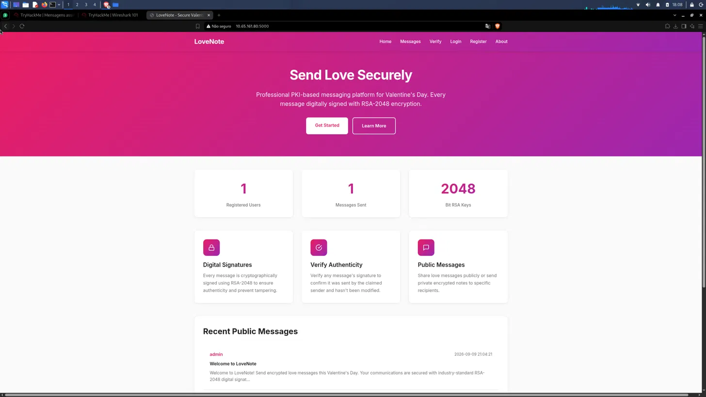
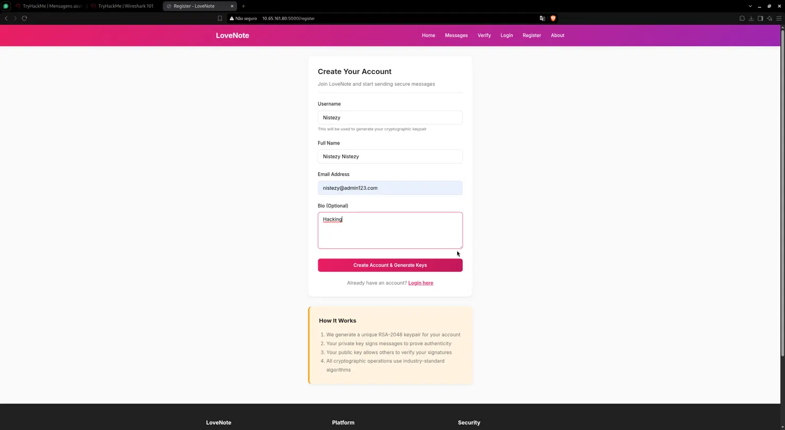
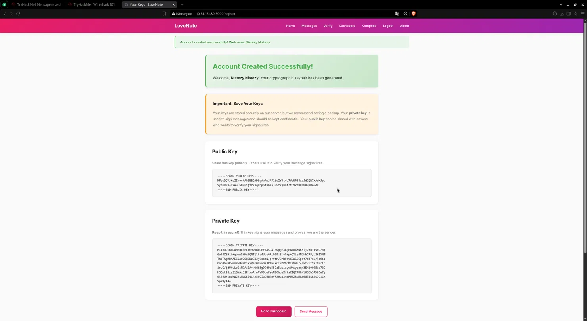
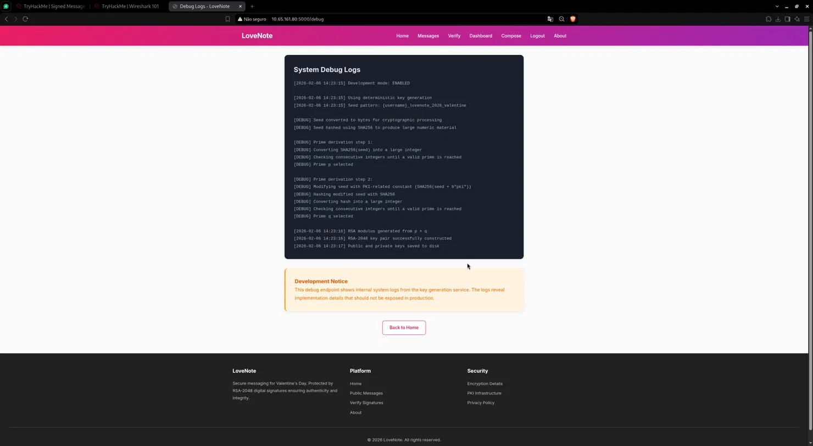
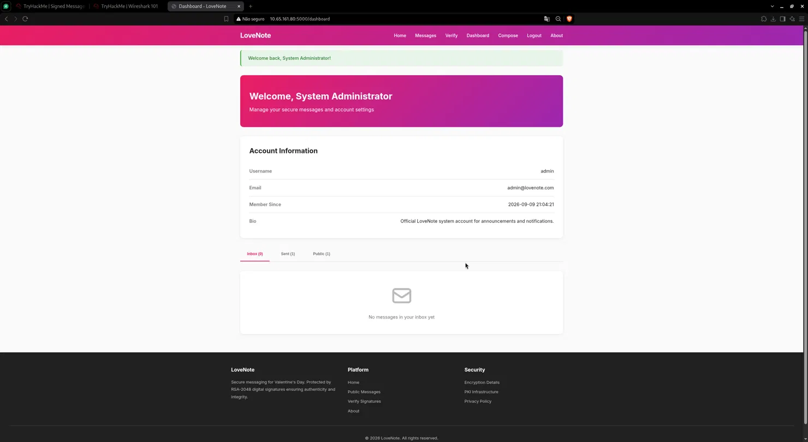
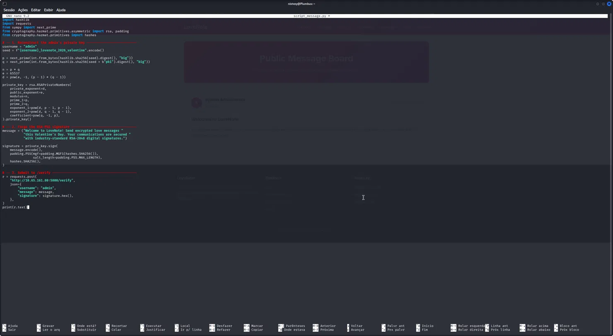
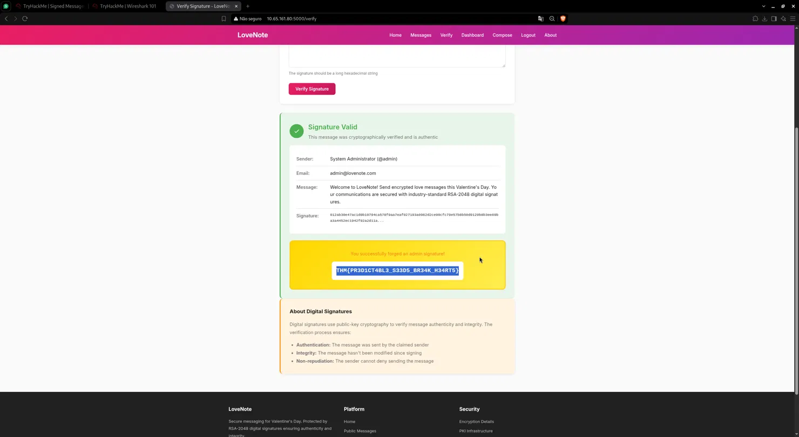

# TryHackMe — Signed Messages
## Level 3 — LoveNote

**Categoria:** Web / Broken Cryptography / Predictable RSA Key Generation  
**Dificuldade:** Médio

---

### 💌 Concierge Briefing

> My Dearest Hacker,
> LoveNote built its reputation on trust. Every message, every action, signed and verified by the system itself. LoveNote claims that no message can be forged, no identity faked.
> Yet an internal leak suggests the platform may be trusting something it shouldn't. With Valentine's Day fast approaching, the consequences of a broken trust system could be disastrous.
>
> You can find the web application here: `http://10.65.161.80:5000`

---

## 🎯 Objetivo

O briefing aponta para um sistema de mensagens baseado em **assinaturas digitais RSA-2048** que afirma ser impossível de falsificar. A pista — *"trusting something it shouldn't"* — sugere que o problema não está no algoritmo criptográfico em si, mas na forma como as chaves são geradas. O objetivo é encontrar a falha na geração de chaves, reconstruir a chave privada do administrador e forjar uma assinatura válida para obter a flag.

---

## 🔍 Passo 1 — Homepage: LoveNote PKI Messaging

Acessando `http://10.65.161.80:5000`:



A plataforma se apresenta como um serviço de mensagens seguras para o Dia dos Namorados, protegido por **assinaturas digitais RSA-2048**. Três estatísticas na homepage chamam atenção imediata:

| Métrica | Valor |
|---------|-------|
| Registered Users | 1 |
| Messages Sent | 1 |
| Bit RSA Keys | 2048 |

A seção **Recent Public Messages** exibe a mensagem pública do administrador, enviada em 2026-09-09 21:04:21, com o conteúdo visível para todos — um detalhe que será crucial nos próximos passos.

---

## 🔍 Passo 2 — Registro: O Username Gera o Keypair

Criando uma conta em `/register`:



Abaixo do campo **Username**, a aplicação exibe uma nota reveladora:

> *"This will be used to generate your cryptographic keypair"*

A seção "How It Works" confirma o modelo:
1. Geração de um keypair RSA-2048 único para a conta
2. A chave privada assina mensagens para provar autenticidade
3. A chave pública permite que outros verifiquem as assinaturas

O username como entrada para geração de chaves é uma pista crítica: se o processo for **determinístico**, qualquer pessoa que conheça o username pode tentar reproduzir o keypair.

---

## 🔍 Passo 3 — Keypair Gerado: RSA-2048 Público e Privado

Após o registro, a aplicação exibe o par de chaves completo:



A página confirma que o processo de geração é automático, baseado no username, e que ambas as chaves são armazenadas no servidor. A chave privada é mostrada ao usuário apenas uma vez.

O modelo de funcionamento está claro — mas a real vulnerabilidade ainda precisava ser encontrada.

---

## 🔍 Passo 4 — Página de Debug: O Algoritmo Exposto

Acessando `http://10.65.161.80:5000/debug`:



A página estava **acessível publicamente**, sem qualquer autenticação, e exibia os logs internos do serviço de geração de chaves:

```
[2026-02-06 14:23:15] Development mode: ENABLED
[2026-02-06 14:23:15] Using deterministic key generation
[2026-02-06 14:23:15] Seed pattern: {username}_lovenote_2026_valentine

[DEBUG] Seed converted to bytes for cryptographic processing
[DEBUG] Seed hashed using SHA256 to produce large numeric material

[DEBUG] Prime derivation step 1:
[DEBUG] Converting SHA256(seed) into a large integer
[DEBUG] Checking consecutive integers until a valid prime is reached
[DEBUG] Prime p selected

[DEBUG] Prime derivation step 2:
[DEBUG] Modifying seed with PKI-related constant (SHA256(seed + b"pki"))
[DEBUG] Hashing modified seed with SHA256
[DEBUG] Converting hash into a large integer
[DEBUG] Checking consecutive integers until a valid prime is reached
[DEBUG] Prime q selected

[2026-02-06 14:23:18] RSA modulus generated from p × q
[2026-02-06 14:23:18] RSA-2048 key pair successfully constructed
[2026-02-06 14:23:17] Public and private keys saved to disk
```

O **Development Notice** ao final confirmava o impacto:

> *"This debug endpoint shows internal system logs from the key generation service. The logs reveal implementation details that should not be exposed in production."*

A vulnerabilidade estava completamente documentada no próprio sistema:

- O algoritmo de geração de chaves é **determinístico**
- A semente segue o padrão exato: **`{username}_lovenote_2026_valentine`**
- O primo `p` é derivado de `SHA256(seed)`
- O primo `q` é derivado de `SHA256(seed + b"pki")`

Para o usuário `admin`, a semente é `admin_lovenote_2026_valentine` — um valor completamente conhecido e reproduzível. Isso significa que a **chave privada do admin pode ser reconstruída do zero**.

---

## 🔍 Passo 5 — Contexto: Dashboard do Administrador

Antes de executar o ataque, o dashboard público do admin confirmou os dados do alvo:



| Campo | Valor |
|-------|-------|
| **Username** | `admin` |
| **Email** | `admin@lovenote.com` |
| **Sent** | 1 mensagem |
| **Public** | 1 mensagem |

A mensagem pública do admin — visível na homepage — era o alvo a ser assinado de forma forjada.

---

## 🔍 Passo 6 — Exploit: Reconstruindo a Chave Privada e Forjando a Assinatura

Com o algoritmo de geração exposto, foi escrito um script Python para:
1. Reconstruir a chave privada do admin
2. Assinar a mensagem pública do admin com ela
3. Submeter ao endpoint `/verify` como se fosse o administrador



```python
import hashlib
import requests
from sympy import next_prime
from cryptography.hazmat.primitives.asymmetric import rsa, padding
from cryptography.hazmat.primitives import hashes

# — 1. Reconstruir a chave privada do admin
username = "admin"
seed = f"{username}_lovenote_2026_valentine".encode()

p = next_prime(int.from_bytes(hashlib.sha256(seed).digest(), "big"))
q = next_prime(int.from_bytes(hashlib.sha256(seed + b"pki").digest(), "big"))

n = p * q
e = 65537
d = pow(e, -1, (p - 1) * (q - 1))

private_key = rsa.RSAPrivateNumbers(
    private_exponent=d,
    public_exponent=e,
    modulus=n,
    prime_1=p,
    prime_2=q,
    exponent_1=pow(d, p - 1, p - 1),
    exponent_2=pow(d, q - 1, q - 1),
    coefficient=pow(q, -1, p),
).private_key()

# — 2. Forjar a assinatura RSA-PSS
message = ("Welcome to LoveNote! Send encrypted love messages "
           "this Valentine's Day. Your communications are secured "
           "with industry-standard RSA-2048 digital signatures.")

signature = private_key.sign(
    message.encode(),
    padding.PSS(mgf=padding.MGF1(hashes.SHA256()),
                salt_length=padding.PSS.MAX_LENGTH),
    hashes.SHA256(),
)

# — 3. Submeter ao /verify como admin
r = requests.post(
    "http://10.65.161.80:5000/verify",
    json={
        "username": "admin",
        "message": message,
        "signature": signature.hex(),
    },
)
print(r.text)
```

O processo é matematicamente preciso:
- Como a semente é pública e o algoritmo é determinístico, `p` e `q` são idênticos aos gerados originalmente pelo servidor para o usuário `admin`
- Com `p` e `q` em mãos, `n = p × q`, `d = e⁻¹ mod (p-1)(q-1)` e a chave privada completa podem ser reconstruídos
- A assinatura RSA-PSS gerada é **criptograficamente indistinguível** de uma assinatura legítima do admin

---

## 🚩 Passo 7 — Flag: Assinatura Forjada Verificada

O script foi executado e a resposta submetida ao endpoint `/verify`:



```
✅ Signature Valid
This message was cryptographically verified and is authentic

Sender:    System Administrator (@admin)
Email:     admin@lovenote.com
Message:   Welcome to LoveNote! Send encrypted love messages this
           Valentine's Day. Your communications are secured with
           industry-standard RSA-2048 digital signatures.
Signature: 012ab3be47ac1d0b10794ca578f0aa7eaf027193a0962d2ce90c...

⚠️ You successfully forged an admin signature!

THM{PR3D1CT4BL3_S33DS_BR34K_H34RT5}
```

A assinatura forjada passou na verificação criptográfica — porque matematicamente **ela é correta**. O problema nunca foi o RSA; foi a semente.

---

## 🚩 Flag

```
THM{PR3D1CT4BL3_S33DS_BR34K_H34RT5}
```

---

## 📝 Resumo da cadeia de investigação

1. **Homepage** → plataforma PKI com 1 usuário admin e 1 mensagem pública assinada
2. **Registro** → nota explícita: "username será usado para gerar o keypair criptográfico"
3. **Keypair** → RSA-2048 gerado automaticamente e determinísticamente após cadastro
4. **`/debug`** → endpoint público expõe o algoritmo completo:
   - Geração **determinística** com semente `{username}_lovenote_2026_valentine`
   - `p = next_prime(SHA256(seed))`
   - `q = next_prime(SHA256(seed + b"pki"))`
5. **Análise** → para username `admin`, seed = `admin_lovenote_2026_valentine` → totalmente reproduzível
6. **Script Python** → reconstrói `p`, `q`, `d` e a chave privada completa do admin → assina a mensagem pública com RSA-PSS
7. **`/verify`** → assinatura forjada aceita como válida → `THM{PR3D1CT4BL3_S33DS_BR34K_H34RT5}`
 
 ---