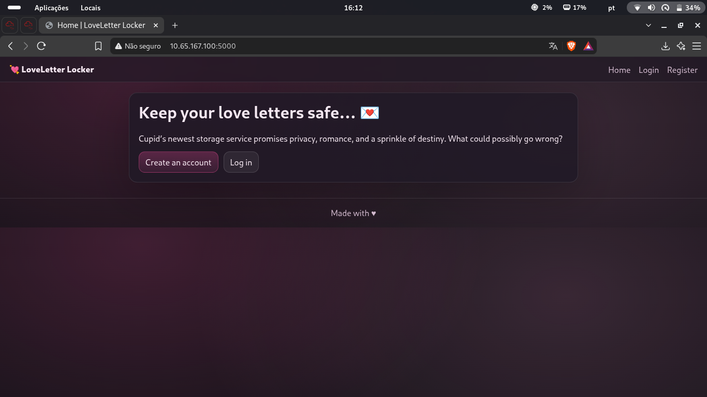
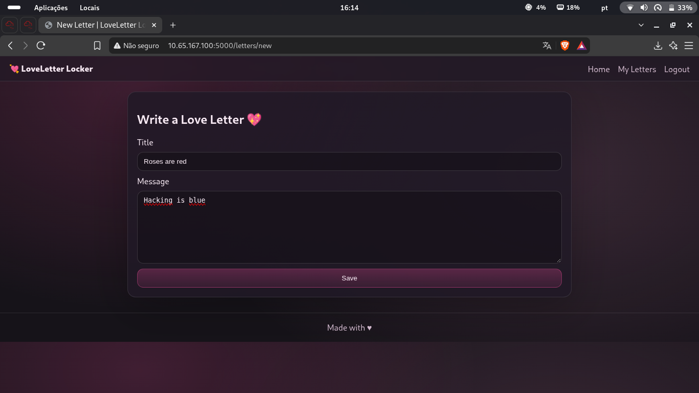
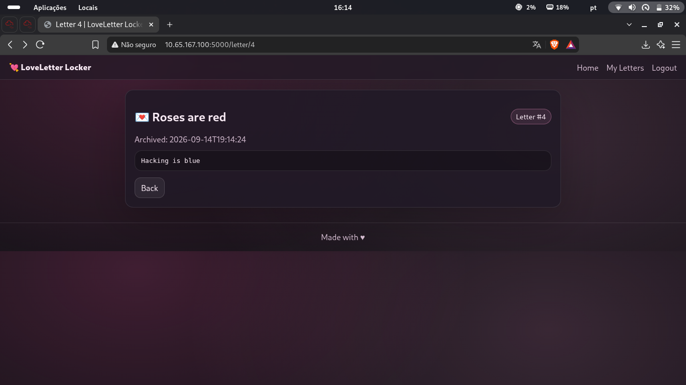
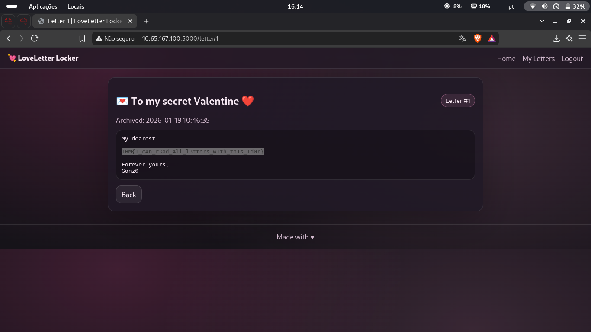

# TryHackMe — Love Letter Locker
## Level 7 — IDOR via Sequential Letter IDs

**Categoria:** Web / IDOR (Insecure Direct Object Reference)  
**Dificuldade:** Fácil

---

### 💌 Concierge Briefing

> My Dearest Hacker,
> Welcome to LoveLetter Locker, where you can safely write and store your Valentine's letters. For your eyes only?
>
> You can access the web app here: `http://10.65.167.100:5000`

---

## 🎯 Objetivo

O briefing entrega a pista na própria pontuação: **"For your eyes only?"** — a interrogação sugere que as cartas talvez não sejam tão privadas quanto a plataforma promete. O objetivo é entender como as cartas são referenciadas, identificar se existe controle de acesso entre usuários e acessar cartas que não pertencem à conta autenticada.

---

## 🔍 Passo 1 — Homepage: LoveLetter Locker

Acessando `http://10.65.167.100:5000`:



A plataforma se apresenta como um serviço de armazenamento seguro de cartas de amor:

> *"Keep your love letters safe... 💌"*
> *"Cupid's newest storage service promises privacy, romance, and a sprinkle of destiny. What could possibly go wrong?"*

A frase *"What could possibly go wrong?"* é outra pista implícita. Após criar uma conta e fazer login, o próximo passo foi explorar as funcionalidades disponíveis.

---

## 🔍 Passo 2 — Criando uma Carta: Identificando o Padrão de URL

Acessando `/letters/new`, foi criada uma carta de teste:



| Campo | Valor |
|-------|-------|
| **Title** | Roses are red |
| **Message** | Hacking is blue |

Após salvar, a aplicação redirecionou para a página da carta recém-criada.

---

## 🔍 Passo 3 — Identificando o IDOR: ID Numérico Sequencial na URL

A carta criada foi atribuída ao endereço `/letter/4`:



```
http://10.65.167.100:5000/letter/4
```

A estrutura da URL é imediatamente suspeita: um **ID numérico sequencial** (`/letter/4`) identifica cada carta. Se a aplicação não verificar se a carta pertence ao usuário autenticado antes de exibi-la, qualquer ID válido poderá ser acessado por qualquer usuário logado — **Insecure Direct Object Reference (IDOR)**.

A carta 4 é a mais recente. Cartas com IDs menores foram criadas por outros usuários. Testando `/letter/1`:

```
http://10.65.167.100:5000/letter/1
```

---

## 🚩 Passo 4 — Explorando o IDOR: Lendo a Carta de Outro Usuário

Ao acessar `/letter/1`, a aplicação exibiu a carta de outro usuário **sem qualquer verificação de propriedade**:



```
📩 To my secret Valentine ❤️                          Letter #1
Archived: 2026-01-19 10:46:35

My dearest...
THM{1 c4n r3ad 4ll l3tters w1th th1s 1d0r}
Forever yours,
Gonz0
```

A carta pertence ao usuário **Gonz0** e foi acessada com a conta de outro usuário sem qualquer restrição. A flag, embutida na própria mensagem, confirma a vulnerabilidade:

> *"I can read all letters with this IDOR"*

---

## 🚩 Flag

```
THM{1 c4n r3ad 4ll l3tters w1th th1s 1d0r}
```

---

## 📝 Resumo da cadeia de investigação

1. **Homepage** → LoveLetter Locker promete privacidade com um *"What could possibly go wrong?"* suspeito
2. **Registro + Login** → conta criada para interagir com a aplicação
3. **`/letters/new`** → carta de teste criada → salva em `/letter/4` (ID numérico sequencial visível na URL)
4. **IDOR identificado** → `/letter/{id}` sem verificação de propriedade = qualquer ID acessível
5. **`/letter/1`** → carta do usuário Gonz0 acessada sem autenticação como dono
6. **Flag**: `THM{1 c4n r3ad 4ll l3tters w1th th1s 1d0r}`
